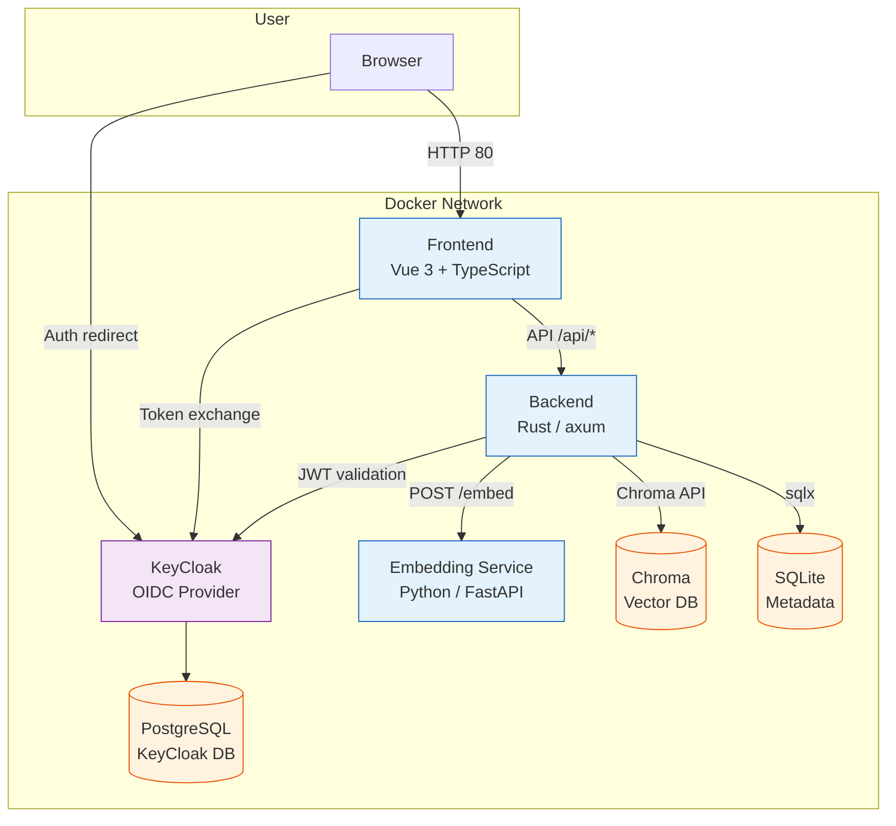
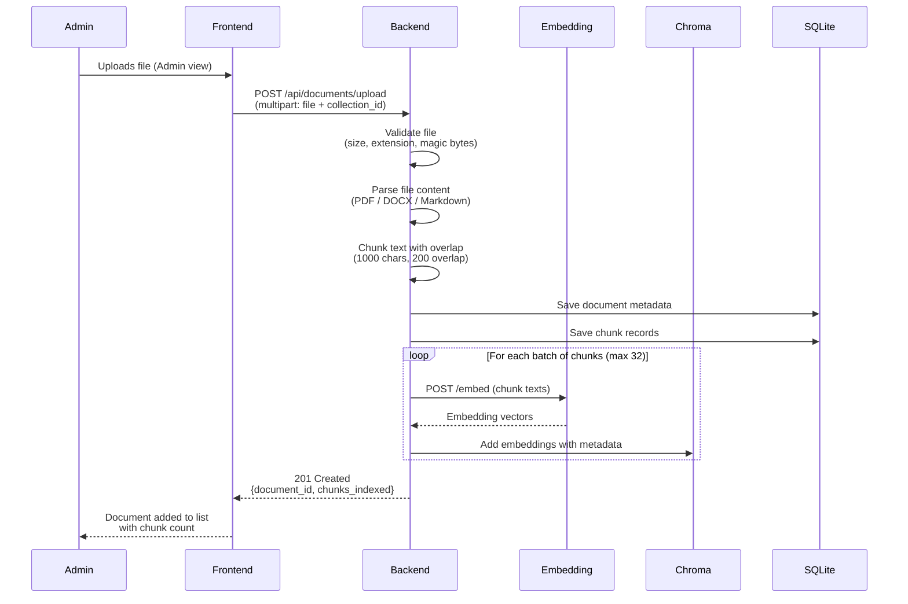
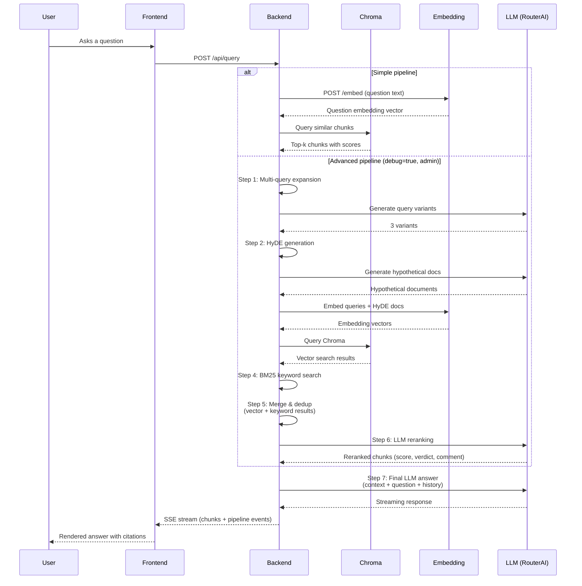

[← Getting Started](getting-started.md) · [Back to README](../README.md) · [User Interface Guide →](gui.md)

# Architecture

## System Overview

The system uses a six-service microservices architecture. The **backend** is the orchestrator — it accepts user requests, coordinates retrieval from Chroma, calls the embedding service, and streams LLM responses. All inter-service communication happens over Docker's internal bridge network.



## Service Breakdown

### 1. Backend (Rust/axum)

REST API server that handles all business logic. Follows the **Structured Modules (Technical Layers)** pattern.

```
backend/src/
├── main.rs              # Entry point, router wiring
├── config.rs            # Environment-based configuration
├── lib.rs               # Re-exports
├── modules/
│   ├── documents/       # Upload, parsing, chunking
│   ├── collections/     # Collection CRUD
│   ├── query/           # RAG pipeline, Q&A
│   ├── conversations/   # Chat sessions, messages
│   ├── auth/            # Auth endpoints (me, logout), UserContext
│   └── git_sync/        # Git repository sync (clone, pull, parse, index)
└── shared/
    ├── auth.rs          # Bearer token middleware, JWT validator
    ├── error.rs         # Unified AppError enum
    ├── llm.rs           # LLM client (RouterAI)
    ├── chunking.rs      # Text splitting
    ├── embedding_client.rs  # Embedding service HTTP client
    ├── chroma_client.rs     # Chroma HTTP client
    ├── file_validation.rs   # MIME + magic bytes checks
    ├── rate_limit.rs        # Body size limiting
    └── types.rs             # Shared types
```

**Dependency rules:** `Handlers → Service → Repository`. Layers never skip or reverse.

### 2. Embedding Service (Python/FastAPI)

A lightweight FastAPI service that wraps `sentence-transformers` (BAAI/bge-small-en-v1.5) with disk-based caching via `diskcache`.

```
embedding/src/
├── main.py       # FastAPI app, /embed and /health endpoints
├── models.py     # Pydantic request/response schemas
├── service.py    # EmbeddingService wrapping SentenceTransformer
└── cache.py      # CachedEmbedder with diskcache
```

- **POST /embed** — accepts `{"texts": [...]}`, returns `{"embeddings": [[...]], "model": "..."}`
- Embeddings cached by exact text match using `diskcache`

### 3. Chroma (Vector Database)

Persistent ChromaDB instance storing document chunk vectors. Data persists in a Docker volume (`chroma_data`).

### 4. KeyCloak (OIDC/OAuth2 Identity Provider)

KeyCloak 26 provides authentication via the OAuth 2.0 Authorization Code flow with PKCE. It runs with a dedicated PostgreSQL 16 database (`keycloak-db`).

- **Realm:** `vedo-hub` with three-tier RBAC (`guest`, `user`, `admin`)
- **Clients:** `vedo-frontend` (public, PKCE) and `vedo-backend` (confidential, service accounts)
- **Social Identity Providers:** Yandex, VK ID, Mail.ru (optional, enabled via env vars)
- **Realm import:** `keycloak/realm-import.json.template` with env var substitution on startup (no credentials in repo)

All authentication is handled exclusively by KeyCloak JWT tokens — the legacy API key mechanism has been removed.

### 5. Frontend (Vue 3 + TypeScript)

Single-page application with five views:

- **Chat view** (`/`) — streaming Q&A interface with message history
- **Admin view** (`/admin`) — document upload and collection management
- **Login view** (`/login`) — social login via KeyCloak (Yandex, VK ID, Mail.ru)
- **Callback view** (`/callback`) — OIDC callback handler (PKCE code exchange)
- **Avatar Preview view** (`/avatar-preview`) — UI component playground

```
frontend/src/
├── main.ts
├── App.vue
├── assets/
│   ├── design-tokens.css    # Full design system CSS (from ui-kit.lib.pen)
│   └── chat-tokens.css      # Chat-specific CSS custom properties
├── api/
│   ├── client.ts            # API client with Bearer token support
│   ├── types.ts             # TypeScript interfaces (document, collection, session, git-sync, etc.)
│   └── auth.ts              # Token storage in localStorage
├── components/
│   ├── ui/                  # Atomic UI components (Pencil design system)
│   │   ├── VButton.vue      # 5 variants (primary/outline/ghost/small/destructive)
│   │   ├── VInput.vue       # Text input with design tokens
│   │   ├── VSelect.vue      # Custom dropdown select
│   │   ├── VDialog.vue      # Modal dialog (420px, 16px radius)
│   │   ├── VAvatar.vue      # User/assistant avatar (3 sizes)
│   │   ├── VBadge.vue       # Status badge (sm/xs, 4 variants)
│   │   ├── VLabel.vue       # Field label with required state
│   │   ├── VProgressBar.vue # Animated progress bar
│   │   ├── VDropZone.vue    # File drop zone (drag & drop)
│   │   ├── VThemeToggle.vue # Dark/light theme toggle
│   │   └── VToast.vue       # Toast notification (auto-dismiss)
│   ├── AppHeader.vue        # Top navigation bar
│   ├── LoginButtons.vue     # Social login provider buttons
│   ├── ChatWindow.vue       # Chat message list + input
│   ├── MessageBubble.vue    # Single message with citations
│   ├── DocumentList.vue     # Uploaded documents list
│   ├── CollectionManager.vue  # Collection CRUD
│   └── GitRepoManager.vue   # Git repo connect, sync, delete
├── stores/
│   ├── chat.ts              # Pinia store for chat state
│   ├── documents.ts         # Documents store
│   ├── collections.ts       # Collections store
│   └── auth.ts              # Auth/user store
├── composables/
│   ├── useOidcAuth.ts       # PKCE OIDC auth flow
│   ├── useStreamingChat.ts  # SSE streaming composable
│   └── useTheme.ts          # Theme switching
├── utils/
│   └── markdown.ts          # Markdown renderer with highlight.js & GFM
└── views/
    ├── ChatView.vue         # Main chat page
    ├── AdminView.vue        # Admin panel
    ├── LoginView.vue        # Login with social providers
    ├── CallbackView.vue     # OIDC callback handler
    └── AvatarPreviewView.vue # UI component preview
```

## Document Ingestion Flow

When an administrator uploads a document, the backend orchestrates validation, parsing, chunking, embedding, and indexing. All chunks are embedded in parallel batches and stored in Chroma alongside SQLite metadata.



1. Admin uploads a file through the Admin view in the frontend
2. Frontend sends a multipart POST request to the backend
3. Backend validates the file — checks extension whitelist (PDF, MD, DOCX), size limit (50 MB), and magic bytes to confirm file type
4. Backend parses the raw text from the file using format-specific extractors
5. Backend splits the text into overlapping chunks (1000 chars, 200 char overlap) for granular retrieval
6. Backend persists document metadata and chunk records to SQLite
7. Backend sends chunk texts in batches to the embedding service, then stores the resulting vectors in Chroma with document metadata for filtered search
8. Frontend updates the document list with the uploaded file's details

## RAG Pipeline (Query Flow)



### Simple Pipeline

1. User asks a question in the chat UI
2. Backend embeds the question via the embedding service
3. Backend queries Chroma for the most relevant chunks
4. Backend builds a prompt with context + conversation history
5. Backend streams the LLM response to the frontend via SSE
6. Frontend renders the answer inline with source citations

### Advanced RAG Pipeline (v0.4.2)

When `ADVANCED_RAG_ENABLED=true` (default) and `"debug": true` is sent with a query by an admin user, the backend runs a 7-step pipeline before generating the final answer:

| Step | Name | Description |
|------|------|-------------|
| 1 | **Multi-query expansion** | Generates query variants via LLM to capture different phrasings of the question |
| 2 | **HyDE** (Hypothetical Document Embeddings) | Generates a hypothetical ideal document for each query variant via LLM |
| 3 | **Embedding search** | Embeds all queries + HyDE docs and searches Chroma for relevant chunks |
| 4 | **BM25 keyword search** | Runs keyword-based search (BM25) on query tokens for lexical matching |
| 5 | **Merge & dedup** | Merges vector and keyword results, removes duplicates, reports source breakdown |
| 6 | **LLM reranking** | Reranks merged chunks using an LLM judge (score 1-10, verdict "брать"/"не брать", explanation) |
| 7 | **Final answer** | Constructs context from accepted chunks and streams the LLM answer with citations |

**Data flow:**

```
User Query
    │
    ├──→ [1] Multi-query ──→ 3 variants
    │                           │
    ├──→ [2] HyDE ──────────→ 3 hypothetical docs
    │                           │
    ├──→ [3] Embedding ──────→ Vector search (Chroma)
    │                           │
    ├──→ [4] BM25 ───────────→ Keyword search (local)
    │                           │
    ├──→ [5] Merge & dedup ───→ Combine results
    │                           │
    ├──→ [6] Reranking ───────→ LLM judge (accept/reject)
    │                           │
    └──→ [7] Final LLM ───────→ Streamed answer + sources
```

Pipeline stage events are emitted via SSE (`type: "pipeline_stage"`) during processing and collected by the frontend's `ragDebug` Pinia store for real-time visualization in the admin panel's **RAG Pipeline Debug** tab. The full `DebugData` object is persisted in `messages.debug_data` for historical review.

Steps 1-2 (multi-query, HyDE) and steps 4-6 (keyword, merge, rerank) are only active when `ADVANCED_RAG_ENABLED=true` and `debug=true`. When `debug=false` or `ADVANCED_RAG_ENABLED=false`, the pipeline falls back to the simple Chroma search path (embed → search → LLM).

### Configuration

The advanced RAG pipeline is configured via environment variables (see [Configuration](configuration.md) for full details):

| Variable | Default | Description |
|----------|---------|-------------|
| `ADVANCED_RAG_ENABLED` | `true` | Master switch for the advanced pipeline |
| `MULTI_QUERY_COUNT` | `3` | Number of query variants to generate |
| `HYBRID_TOP_K` | `3` | Top-K results from BM25 keyword search |
| `RERANK_TOP_K` | `5` | Top-K chunks after LLM reranking |
| `LLM_RERANK_MODEL` | _(same as LLM_MODEL)_ | Separate model for the reranking judge

## See Also

- [Getting Started](getting-started.md) — installation and first run
- [API Reference](api.md) — endpoint details
- [Deployment](deployment.md) — production setup
