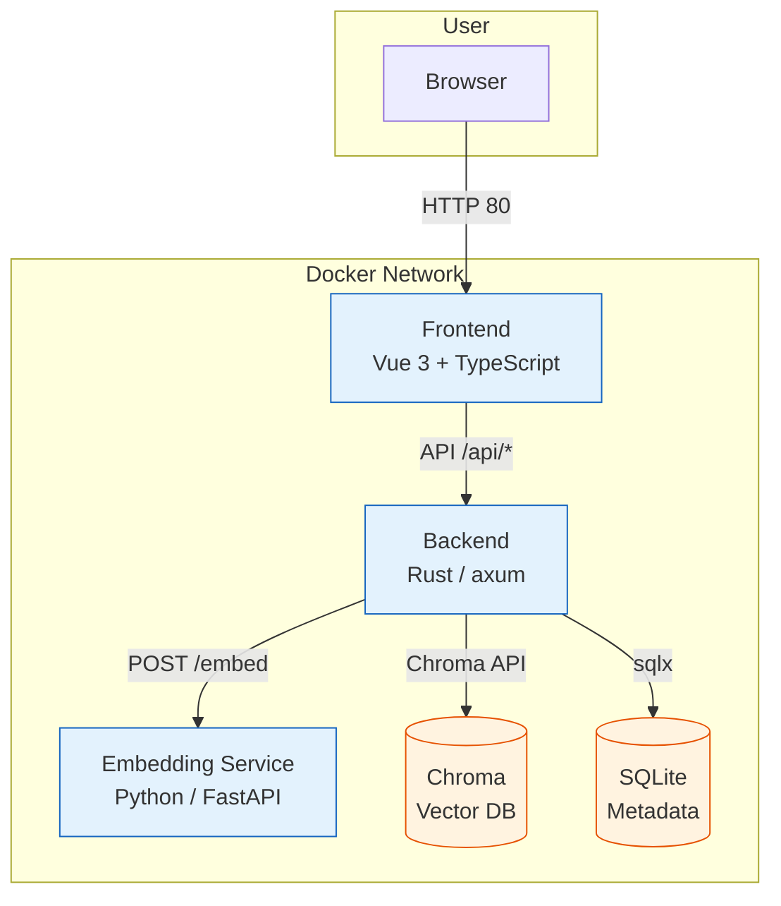
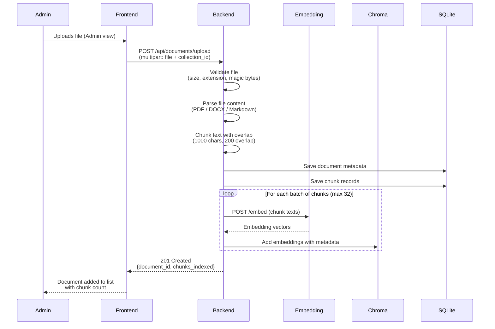
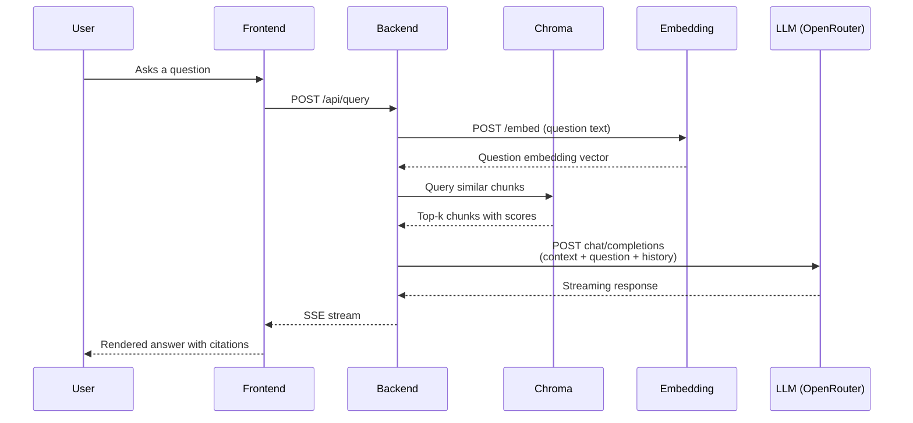

[← Getting Started](getting-started.md) · [Back to README](../README.md) · [User Interface Guide →](gui.md)

# Architecture

## System Overview

The system uses a four-service microservices architecture. The **backend** is the orchestrator — it accepts user requests, coordinates retrieval from Chroma, calls the embedding service, and streams LLM responses. All inter-service communication happens over Docker's internal bridge network.



## Service Breakdown

### 1. Backend (Rust/axum)

REST API server that handles all business logic. Follows the **Structured Modules (Technical Layers)** pattern.

```
backend/src/
├── main.rs              # Entry point, router wiring
├── config.rs            # Environment-based configuration
├── lib.rs               # Re-exports
├── modules/
│   ├── documents/       # Upload, parsing, chunking
│   ├── collections/     # Collection CRUD
│   ├── query/           # RAG pipeline, Q&A
│   └── conversations/   # Chat sessions, messages
└── shared/
    ├── auth.rs          # Bearer token middleware
    ├── error.rs         # Unified AppError enum
    ├── llm.rs           # OpenRouter client
    ├── chunking.rs      # Text splitting
    ├── embedding_client.rs  # Embedding service HTTP client
    ├── chroma_client.rs     # Chroma HTTP client
    ├── file_validation.rs   # MIME + magic bytes checks
    ├── rate_limit.rs        # Body size limiting
    └── types.rs             # Shared types
```

**Dependency rules:** `Handlers → Service → Repository`. Layers never skip or reverse.

### 2. Embedding Service (Python/FastAPI)

A lightweight FastAPI service that wraps `sentence-transformers` (BAAI/bge-small-en-v1.5) with disk-based caching via `diskcache`.

```
embedding/src/
├── main.py       # FastAPI app, /embed and /health endpoints
├── models.py     # Pydantic request/response schemas
├── service.py    # EmbeddingService wrapping SentenceTransformer
└── cache.py      # CachedEmbedder with diskcache
```

- **POST /embed** — accepts `{"texts": [...]}`, returns `{"embeddings": [[...]], "model": "..."}`
- Embeddings cached by exact text match using `diskcache`

### 3. Chroma (Vector Database)

Persistent ChromaDB instance storing document chunk vectors. Data persists in a Docker volume (`chroma_data`).

### 4. Frontend (Vue 3 + TypeScript)

Single-page application with two views:

- **Chat view** (`/`) — streaming Q&A interface with message history
- **Admin view** (`/admin`) — document upload and collection management

```
frontend/src/
├── main.ts
├── App.vue
├── router.ts              # Vue Router (/, /admin)
├── api/
│   ├── client.ts          # Axios-like API client
│   └── types.ts           # TypeScript interfaces
├── components/
│   ├── ChatWindow.vue     # Chat message list + input
│   ├── MessageBubble.vue  # Single message with citations
│   ├── DocumentList.vue   # Uploaded documents list
│   └── CollectionManager.vue  # Collection CRUD
├── stores/
│   ├── chat.ts            # Pinia store for chat state
│   ├── documents.ts       # Documents store
│   └── collections.ts     # Collections store
└── views/
    ├── ChatView.vue       # Main chat page
    └── AdminView.vue      # Admin panel
```

## Document Ingestion Flow

When an administrator uploads a document, the backend orchestrates validation, parsing, chunking, embedding, and indexing. All chunks are embedded in parallel batches and stored in Chroma alongside SQLite metadata.



1. Admin uploads a file through the Admin view in the frontend
2. Frontend sends a multipart POST request to the backend
3. Backend validates the file — checks extension whitelist (PDF, MD, DOCX), size limit (50 MB), and magic bytes to confirm file type
4. Backend parses the raw text from the file using format-specific extractors
5. Backend splits the text into overlapping chunks (1000 chars, 200 char overlap) for granular retrieval
6. Backend persists document metadata and chunk records to SQLite
7. Backend sends chunk texts in batches to the embedding service, then stores the resulting vectors in Chroma with document metadata for filtered search
8. Frontend updates the document list with the uploaded file's details

## RAG Pipeline (Query Flow)



1. User asks a question in the chat UI
2. Backend embeds the question via the embedding service
3. Backend queries Chroma for the most relevant chunks
4. Backend builds a prompt with context + conversation history
5. Backend streams the LLM response to the frontend via SSE
6. Frontend renders the answer inline with source citations

## See Also

- [Getting Started](getting-started.md) — installation and first run
- [API Reference](api.md) — endpoint details
- [Deployment](deployment.md) — production setup
