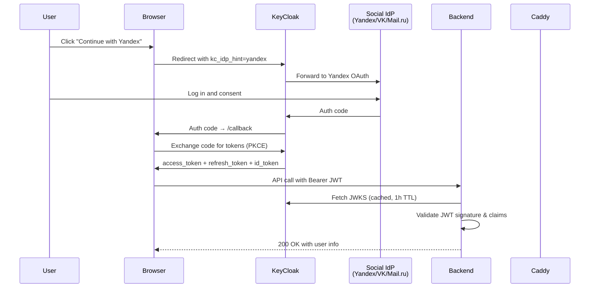

[← API Reference](api.md) · [Back to README](../README.md) · [Configuration →](configuration.md)

# Authentication

VEDO hub uses **KeyCloak 26** as its identity provider (IdP), implementing the OAuth 2.0 Authorization Code flow with **PKCE** (Proof Key for Code Exchange) for the public frontend client. All API requests are authenticated via KeyCloak-issued JWT tokens.

---

## Architecture



## Flow Overview

### 1. Login

1. User navigates to `/login` and clicks a social provider button (Yandex, VK ID, or Mail.ru)
2. The browser redirects to KeyCloak's authorization endpoint with:
   - `kc_idp_hint` — skips the KeyCloak login form, goes directly to the social IdP
   - PKCE `code_challenge` and `state` (stored in `localStorage` for callback verification)
3. After successful authentication at the social provider, KeyCloak redirects back to `/callback` with an authorization `code`
4. The `/callback` handler exchanges the code for tokens via `POST {keycloak}/realms/vedo-hub/protocol/openid-connect/token`
5. `access_token`, `refresh_token`, and `id_token` are stored in `localStorage`

### 2. Authenticated Requests

- The API client (in `frontend/src/api/client.ts`) attaches the `access_token` as a `Bearer` token to all requests
- The backend auth middleware validates the JWT using a **cached JWKS** (JSON Web Key Set) fetched from KeyCloak's certs endpoint
- JWT validation checks: signature, issuer (`{keycloak_url}/realms/vedo-hub`), audience (`vedo-backend`), and expiration

### 3. Token Refresh

- A background timer is scheduled for `exp - REFRESH_MARGIN_MS` (default 60s before expiry)
- On page load, `restoreSession()` checks for an existing `refresh_token` and attempts silent refresh
- On successful refresh, the new `access_token` and `refresh_token` replace the old ones in `localStorage`
- Minimum interval of 30s between refresh attempts to prevent tight error-retry loops

### 4. Logout

The frontend calls `POST /api/auth/logout` (client-side acknowledgement), clears all tokens from `localStorage`, and redirects the user to KeyCloak's `end_session_endpoint` for RP-initiated logout.

---

## Prerequisites

- Docker with Compose plugin (v2.22+)
- KeyCloak container image (`quay.io/keycloak/keycloak:26.1`)

---

## KeyCloak Setup

### Realm Configuration

KeyCloak is configured via a **realm import template** at `keycloak/realm-import.json.template`. On startup, the `keycloak-init` init container validates that all required environment variables are set, then uses `envsubst` to substitute `${VAR}` placeholders and produces the final `realm-import.json`. Keycloak then imports the realm from the generated file.

**No credentials are stored in the repository** — all secrets (user passwords, client secrets) come from `.env`.

> **⚠️ Import strategy is `IGNORE_EXISTING`.** The realm is only created on the first successful import. Subsequent starts skip the import entirely — changes to `realm-import.json.template` or `.env` passwords have **no effect** on a running realm. To re-apply the template, you must delete the `db_data` volume and restart:
>
> ```bash
> docker compose down -v  # removes all volumes including db_data
> docker compose up -d    # re-imports the realm from the template
> ```
>
> For incremental changes to a running realm, use the Keycloak Admin Console or Admin REST API.

**Realm: `vedo-hub`**

| Setting | Value |
|---------|-------|
| Realm name | `vedo-hub` |
| Display name | VEDO hub |
| Login with email | ✅ Enabled |
| Registration | ❌ Disabled |
| Brute force protection | ✅ Enabled |
| Default roles | `guest` |

**Roles (three-tier RBAC):**

| Role | Description |
|------|-------------|
| `guest` | Read-only. Can view public pages only. |
| `user` | Regular user. Can use RAG queries, manage own conversations and documents. |
| `admin` | Full access. Admin panel, all features. |

### OIDC Clients

#### vedo-frontend (Public Client)

| Setting | Value |
|---------|-------|
| Client ID | `vedo-frontend` |
| Protocol | OpenID Connect |
| Access Type | Public (no secret) |
| Standard Flow | ✅ Enabled |
| Direct Access Grants | ✅ Enabled |
| Root URL | `http://localhost:5173` (dev) |
| Valid Redirect URIs | `http://localhost:5173/*`, `http://localhost:80/*` |
| Web Origins | `http://localhost:5173`, `http://localhost:80` |

**Protocol Mappers:**
- `provider-claim` — maps user attribute `provider` to the JWT claim `provider` (e.g., `yandex`, `vk`, `mailru`, `password`)
- `realm-roles` — maps realm roles (guest, user, admin) to the `roles` claim

#### vedo-backend (Confidential Client)

| Setting | Value |
|---------|-------|
| Client ID | `vedo-backend` |
| Protocol | OpenID Connect |
| Access Type | Confidential (secret via `VEDO_BACKEND_CLIENT_SECRET`) |
| Service Accounts | ✅ Enabled |
| Standard Flow | ✅ Enabled |

### Test Users (Local Development)

| Username | Password | Roles |
|----------|----------|-------|
| `admin` | `VEDO_ADMIN_PASSWORD` | `admin`, `user`, `guest` |
| `alice` | `VEDO_ALICE_PASSWORD` | `user`, `guest` |
| `guest` | `VEDO_GUEST_PASSWORD` | `guest` |

---

## Social Provider Registration

Before enabling social login, register applications at each provider's developer console.

### Yandex

1. Go to [Yandex OAuth Developer Console](https://oauth.yandex.com/)
2. Create a new application, type **Web service**
3. Set the redirect URI: `{KEYCLOAK_HOSTNAME}/realms/vedo-hub/broker/yandex/endpoint`
4. Enable access to: `login:email`, `login:avatar`
5. Note the **Client ID** and **Client Secret**
6. Set `YANDEX_CLIENT_ID` and `YANDEX_CLIENT_SECRET` in `.env`

### VK ID

1. Go to [VK Developers](https://dev.vk.com/)
2. Create a new application, type **OpenID Connect / OAuth 2.0**
3. Set the redirect URI: `{KEYCLOAK_HOSTNAME}/realms/vedo-hub/broker/vk/endpoint`
4. Enable scope: `email`, `phone`
5. Note the **Client ID** and **Secure Key**
6. Set `VK_CLIENT_ID` and `VK_CLIENT_SECRET` in `.env`

### Mail.ru

1. Go to [Mail.ru OAuth](https://o2.mail.ru/app/)
2. Create a new application, type **Web**
3. Set the redirect URI: `{KEYCLOAK_HOSTNAME}/realms/vedo-hub/broker/mailru/endpoint`
4. Enable scope: `userinfo`, `email`
5. Note the **Client ID** and **Client Secret**
6. Set `MAILRU_CLIENT_ID` and `MAILRU_CLIENT_SECRET` in `.env`

**Note:** Social providers are configured as **disabled by default** in the realm import (`"enabled": false`). They are enabled automatically when environment variables are set and non-empty — the entrypoint script enables the identity provider if both ID and Secret are present.

---

## Environment Variables

See [Configuration](configuration.md) for the full reference.

| Variable | Required | Default | Description |
|----------|----------|---------|-------------|
| `KEYCLOAK_DB_PASSWORD` | Yes | `keycloak` | PostgreSQL password for KeyCloak |
| `KEYCLOAK_ADMIN` | No | `admin` | KeyCloak admin console username |
| `KEYCLOAK_ADMIN_PASSWORD` | Yes | `admin` | KeyCloak admin console password (master realm) |
| `KEYCLOAK_HOSTNAME` | No | `localhost` | KeyCloak hostname |
| `VEDO_ADMIN_PASSWORD` | No | `admin` | vedo-hub realm: admin user password |
| `VEDO_ALICE_PASSWORD` | No | `password` | vedo-hub realm: alice user password |
| `VEDO_GUEST_PASSWORD` | No | `guest` | vedo-hub realm: guest user password |
| `VEDO_BACKEND_CLIENT_SECRET` | Yes | `changeme-vedo-backend-secret` | Client secret for `vedo-backend` |
| `YANDEX_CLIENT_ID` | No | _(empty)_ | Yandex OAuth Client ID |
| `YANDEX_CLIENT_SECRET` | No | _(empty)_ | Yandex OAuth Client Secret |
| `VK_CLIENT_ID` | No | _(empty)_ | VK ID Client ID |
| `VK_CLIENT_SECRET` | No | _(empty)_ | VK ID Client Secret |
| `MAILRU_CLIENT_ID` | No | _(empty)_ | Mail.ru OAuth Client ID |
| `MAILRU_CLIENT_SECRET` | No | _(empty)_ | Mail.ru OAuth Client Secret |

---

## Local Development vs Production

### Development

KeyCloak runs alongside other services via `docker-compose.yml`:

```bash
docker compose up -d
```

Caddy proxies `/auth/*` to KeyCloak (port 8080). KeyCloak is accessible at `http://localhost:8080` (direct) or `http://localhost/auth` (via Caddy).

Default admin console: `http://localhost:8080/admin/master/console/#/vedo-hub`

### Production

The production stack (`docker-compose.production.yml`) **includes KeyCloak** — it is required for all authentication. The legacy `ADMIN_API_KEY` mechanism has been removed. Every API request must carry a valid KeyCloak-issued JWT.

---

## Backend Validation Logic

The backend validates tokens in `backend/src/shared/auth.rs`:

1. **Fast path (API key):** If the Bearer token matches `ADMIN_API_KEY`, authenticate immediately as `AuthInfo::ApiKey`
2. **JWT path:** If the token is not the API key, validate it as a KeyCloak JWT:
   - Fetch JWKS from `{keycloak_url}/realms/vedo-hub/protocol/openid-connect/certs`
   - Cache JWKS for 1 hour (TTL: 3600s)
   - Validate signature, issuer (`{keycloak_url}/realms/vedo-hub`), audience (`vedo-backend`), and expiration
   - 30-second clock skew leeway
3. **Fallback:** If neither matches, return `401 Unauthorized`

### API Key vs JWT

| Feature | API Key | JWT (KeyCloak) |
|---------|---------|----------------|
| User identity | Single `admin` user | Multi-user (sub claim) |
| Roles | Implicit admin | From JWT `roles` claim |
| Expiry | Never (manual rotation) | Configurable (via KeyCloak) |
| Setup | Set `ADMIN_API_KEY` | Requires KeyCloak stack |
| Operations | Sync (no network calls) | Async (JWKS fetch) |

---

## Troubleshooting

### Redirect URI Mismatch

**Error:** `invalid parameter: redirect_uri`

**Solution:** Ensure the redirect URI registered in KeyCloak matches exactly what the browser sends. For development this should be `http://localhost:5173/*` (with wildcard). For production, use the actual domain.

### JWKS Errors

**Error:** `JWT validation failed` / `JWKS fetch failed`

**Solutions:**
- Verify `KEYCLOAK_URL` is correct and accessible from the backend container
- Check that `KEYCLOAK_CLIENT_ID` matches the `vedo-backend` client ID
- Ensure the JWT audience (`aud` claim) includes `vedo-backend`
- Restart the backend container to clear the JWKS cache

### Token Expiry

**Symptom:** API returns `401 Unauthorized` after a period of inactivity

**Solution:** The frontend should refresh tokens automatically before expiry. Check browser console for `[useOidcAuth]` debug logs. If auto-refresh fails, the user must re-authenticate via `/login`.

### Social Provider Not Working

**Symptom:** Social login button does nothing or shows an error after redirect

**Solutions:**
- Verify the social provider ID and secret are set correctly in `.env`
- Check the redirect URI at the social provider's developer console matches `{KEYCLOAK_HOSTNAME}/realms/vedo-hub/broker/{provider}/endpoint`
- Look for errors in KeyCloak container logs: `docker compose logs keycloak`
- Ensure the identity provider is enabled (the entrypoint script enables it only when both ID and Secret are non-empty)

---

## See Also

- [Configuration](configuration.md) — all environment variables
- [Deployment](deployment.md) — production setup
- [Getting Started](getting-started.md) — installation and first run
- [API Reference](api.md) — `/api/auth/me` and `/api/auth/logout` endpoints
- `keycloak/realm-import.json.template` — realm configuration template (no secrets)
- `keycloak/realm-import.json` — **generated at runtime** by `keycloak-init` container (gitignored, never committed)
- `frontend/src/composables/useOidcAuth.ts` — PKCE flow implementation
- `backend/src/shared/auth.rs` — JWT validation logic
