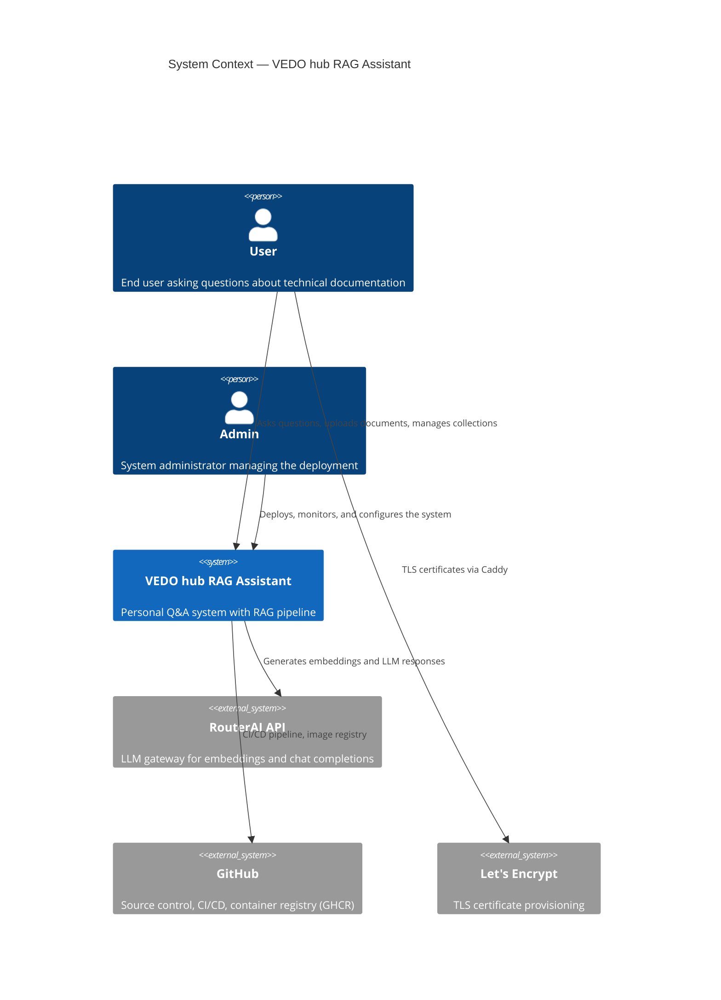
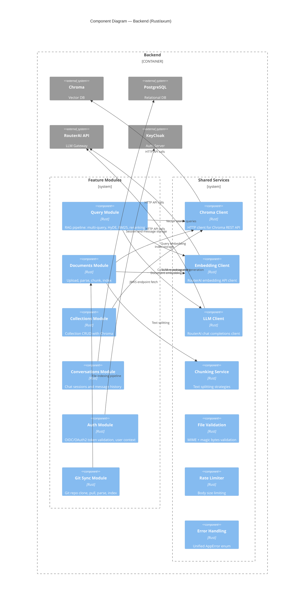
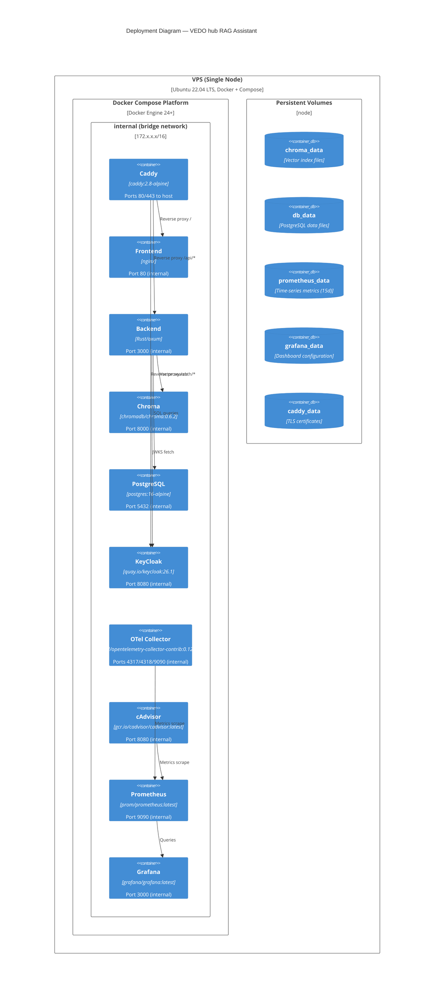

# C4 Architecture Diagrams

> C4 model visualizations for the VEDO hub RAG Assistant.

## System Context Diagram

Shows the system as a whole, its users, and external dependencies.



## Container Diagram

Shows the high-level technical architecture — services, data stores, and communication.

```mermaid
C4Container
    title Container Diagram — VEDO hub RAG Assistant

    Person(user, "User")
    Person(admin, "Admin")

    System_Boundary(vedo, "VEDO hub RAG Assistant") {
        Container(caddy, "Caddy", "Go", "Reverse proxy with TLS termination and rate limiting")

        Container(frontend, "Frontend", "Vue 3 + TypeScript", "SPA served by nginx on port 80")
        Container(backend, "Backend", "Rust/axum", "REST API on port 3000 with SSE streaming")

        ContainerDb(chroma, "Chroma", "Vector Database", "Semantic search on document embeddings")
        ContainerDb(postgres, "PostgreSQL 16", "Relational Database", "Application and KeyCloak data")

        Container(keycloak, "KeyCloak", "Java", "OIDC/OAuth2 authentication server")

        Container(otel, "OTel Collector", "OpenTelemetry", "OTLP receiver for logs, traces, metrics")
        Container(cadvisor, "cAdvisor", "Go", "Container resource metrics exporter")
        Container(prometheus, "Prometheus", "Go", "Metrics storage (15-day retention)")
        Container(grafana, "Grafana", "Go", "Monitoring dashboards with Prometheus datasource")

        Rel(user, caddy, "HTTPS (443)")
        Rel(caddy, frontend, "Reverse proxy / to port 80")
        Rel(caddy, backend, "Reverse proxy /api/* to port 3000")
        Rel(caddy, keycloak, "Reverse proxy /auth/* to port 8080")

        Rel(frontend, backend, "API calls via Caddy")
        Rel(backend, chroma, "Vector search queries")
        Rel(backend, postgres, "Metadata and conversation storage")
        Rel(backend, keycloak, "Token validation (JWKS)")

        Rel(backend, otel, "OTLP export (traces, logs, metrics)")
        Rel(cadvisor, prometheus, "Container metrics scrape on port 8080")
        Rel(otel, prometheus, "Application metrics scrape on port 9090")
        Rel(prometheus, grafana, "Datasource queries")

        Rel(admin, caddy, "SSH tunnel for monitoring access")
        Rel(admin, grafana, "Dashboard access via tunnel")
    }

    Rel(backend, routerai, "Embeddings and LLM completions")
    Rel(vedo, github, "CI/CD and image registry")
```

## Component Diagram

Shows the internal structure of the backend application.



## Deployment Diagram

Shows the physical deployment on a single VPS.



## See Also

- [Runbook](runbook.md) — operational procedures
- [Monitoring](monitoring.md) — dashboards and alerts
- [Deployment](deployment.md) — setup and configuration
- [Architecture](architecture.md) — service interaction overview
