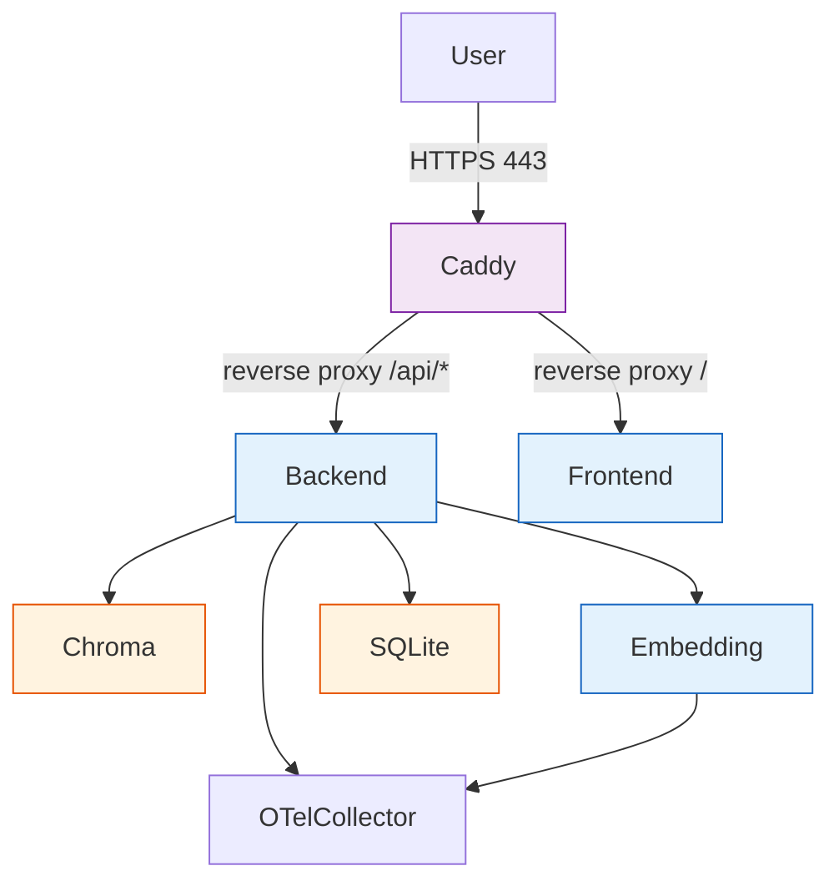

[← Configuration](configuration.md) · [Back to README](../README.md) · [Testing →](testing.md)

# Deployment

## Production Architecture



## Services

The production stack includes:

- **Caddy** — reverse proxy with TLS termination
- **Backend** (Rust/axum) — REST API
- **Frontend** (Vue 3/SPA) — static files served by nginx
- **Embedding** (Python/FastAPI) — text embedding service
- **Chroma** — vector database
- **OTel Collector** — OpenTelemetry protocol (OTLP) receiver for logs, traces, and metrics. All services export structured telemetry to the collector via OTLP gRPC (`:4317`) or HTTP (`:4318`). The collector enriches records with deployment environment and batches them for export (debug/stdout).

## VPS Setup

### Prerequisites

- A VPS with Docker and Docker Compose installed
- A domain name pointing to your server
- RouterAI API key

### Step 1: Clone and configure

```bash
git clone https://github.com/your-org/vedo-rag-assistant.git
cd vedo-rag-assistant

cp .env.example .env
# Edit .env with production values
```

### Step 2: Edit Caddyfile

Replace `example.com` and `your-email@example.com` with your domain and email:

```caddyfile
your-domain.com {
    reverse_proxy /api/* backend:3000
    reverse_proxy / frontend:80
    tls admin@your-domain.com
}
```

Caddy automatically provisions and renews Let's Encrypt TLS certificates.

### Step 3: Start production stack

```bash
docker compose -f docker-compose.yml -f docker-compose.production.yml up -d
```

The production override:
- Adds Caddy reverse proxy (TLS on ports 80/443)
- Removes direct port exposure from backend and frontend
- Routes all traffic through Caddy

### Step 4: Verify

```bash
curl https://your-domain.com/api/health
# → OK
```

### Rate Limiting

Caddy enforces rate limits on the API:

```caddyfile
header /api {
    RateLimit-Limit 30
    RateLimit-Remaining 30
}
```

Adjust the limit in `Caddyfile` as needed.

## CI/CD Pipeline

GitHub Actions runs on every push to `main` and on pull requests:

| Stage | What it does |
|-------|-------------|
| **Format check** | `cargo fmt --check`, `ruff format`, `biome format` |
| **Lint** | `cargo clippy`, `ruff check`, `biome ci` |
| **Test** | `cargo test`, `pytest`, `vitest` |
| **Build** | `vite build` (frontend), Docker image build verification |
| **Coverage** | `cargo tarpaulin`, `pytest --cov` (informational) |

Run all checks locally with:

```bash
make check
```

## Health Checks

| Endpoint | Service | Expected Response |
|----------|---------|-------------------|
| `GET /api/health` | Backend | `OK` |
| `GET /health` | Embedding | `{"status": "ok"}` |
| gRPC health probe | OTel Collector | `localhost:4317` (via grpc_health_probe) |

Docker Compose uses `restart: unless-stopped` on all services for automatic recovery. Health checks are defined for every service in `docker-compose.yml` and use `depends_on` with `condition: service_healthy`.

## Operations Scripts

Production operation scripts are available in `scripts/`:

| Script | Purpose |
|--------|---------|
| `scripts/backup.sh` | Backup SQLite database and Chroma vector store |
| `scripts/restore.sh` | Restore from a previous backup |
| `scripts/smoke-test.sh` | Smoke test — start services and verify health endpoints |
| `scripts/smoke-test-dns.sh` | DNS resolution test for embedding service (VPN-independent) |

## Backup & Restore

### Automated backup

```bash
./scripts/backup.sh
```

Creates timestamped, compressed backups in `backups/` with retention policy (7 daily, 4 weekly, 12 monthly).

### Manual backup

```bash
# SQLite database
docker compose -f docker-compose.yml -f docker-compose.production.yml exec backend \
  sh -c "cp /data/vedo.db /tmp/vedo-$(date +%Y%m%d).db"
docker compose -f docker-compose.yml -f docker-compose.production.yml cp \
  backend:/tmp/vedo-*.db ./backups/

# Chroma vectors
docker compose -f docker-compose.yml -f docker-compose.production.yml exec -T chroma \
  tar czf - -C /chroma/chroma . > ./backups/chroma-$(date +%Y%m%d).tar.gz
```

## Production Hardening

The `docker-compose.production.yml` overlay applies:

- **Read-only filesystem** on all services (except Chroma)
- **No-new-privileges** security option
- **All capabilities dropped** (selective add-back where needed)
- **Non-root user** (`1001:1001`)
- **tmpfs** for `/tmp` with size limits
- **Resource limits** (CPU, memory, PIDs) per service
- **Log rotation** (20 MB per file, 5 files max)
- **Caddy reverse proxy** with Let's Encrypt auto TLS

## See Also

- [Configuration](configuration.md) — environment variables reference
- [Architecture](architecture.md) — service interaction overview
- [Getting Started](getting-started.md) — local development setup
