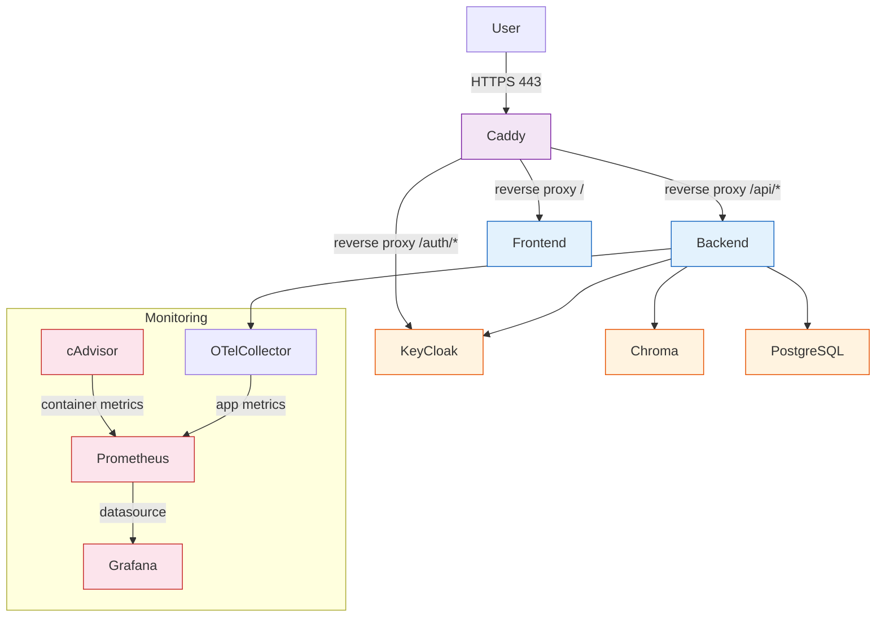

[← Configuration](configuration.md) · [Back to README](../README.md) · [Testing →](testing.md)

# Deployment

## Production Architecture



## Services

The production stack includes:

- **Caddy** — reverse proxy with TLS termination
- **Backend** (Rust/axum) — REST API
- **Frontend** (Vue 3/SPA) — static files served by nginx
- **Chroma** — vector database
- **KeyCloak 26** — OIDC/OAuth2 authentication server
- **PostgreSQL 16** (`db`) — shared relational database for the application (`vedo`) and KeyCloak authentication (`keycloak`) within a single managed instance. Initialized by `scripts/init-db.sh`.
- **OTel Collector** — OpenTelemetry protocol (OTLP) receiver for logs, traces, and metrics. All services export structured telemetry to the collector via OTLP gRPC (`:4317`) or HTTP (`:4318`). The collector enriches records with deployment environment and batches them for export (debug/stdout).
- **cAdvisor** — container resource metrics (CPU, memory, network, disk) exposed on port 8080
- **Prometheus** — time-series metrics database with 15-day retention. Scrapes cAdvisor and OTel collector.
- **Grafana** — monitoring dashboards with pre-configured Prometheus datasource.

## VPS Setup

### Prerequisites

- A VPS with Docker and Docker Compose installed
- A domain name pointing to your server
- RouterAI API key

### Step 1: Clone and configure

```bash
git clone https://github.com/your-org/vedo-rag-assistant.git
cd vedo-rag-assistant

cp .env.example .env
# Edit .env with production values
```

### Step 2: Edit Caddyfile

Replace `example.com` and `your-email@example.com` with your domain and email:

```caddyfile
your-domain.com {
    reverse_proxy /api/* backend:3000
    reverse_proxy / frontend:80
    tls admin@your-domain.com
}
```

Caddy automatically provisions and renews Let's Encrypt TLS certificates.

### Step 3: Start production stack

```bash
docker compose -f docker-compose.yml -f docker-compose.production.yml up -d
```

The production override:
- Adds Caddy reverse proxy (TLS on ports 80/443)
- Removes direct port exposure from backend and frontend
- Routes all traffic through Caddy

### Step 4: Verify

```bash
curl https://your-domain.com/api/health
# → OK
```

### Rate Limiting

Caddy enforces rate limits on the API:

```caddyfile
header /api {
    RateLimit-Limit 30
    RateLimit-Remaining 30
}
```

Adjust the limit in `Caddyfile` as needed.

## CI/CD Pipeline

### CI (Continuous Integration)

GitHub Actions runs on every push to `main` and on pull requests:

| Stage | Workflow | What it does |
|-------|----------|-------------|
| **Format check** | `ci.yml` | `cargo fmt --check`, `biome format` |
| **Lint** | `ci.yml` | `cargo clippy`, `biome ci` |
| **Test** | `ci.yml` | `cargo test`, `vitest` |
| **Build** | `ci.yml` | `vite build` (frontend), Docker image build |
| **Coverage** | `ci.yml` | `cargo tarpaulin` (informational) |
| **Compose lint** | `e2e.yml` | Docker Compose port validation, migration checks |
| **E2E tests** | `e2e.yml` | Playwright E2E tests (Chromium) |

Run all checks locally with:

```bash
make check
```

### CD (Continuous Deployment)

When CI passes on `main`, the **Deploy** workflow (`.github/workflows/deploy.yml`) triggers:

| Stage | Job | What it does |
|-------|-----|-------------|
| **Build & push** | `build-and-push` | Multi-arch Docker images via Buildx, pushed to GitHub Container Registry with `latest` and `git-sha` tags |
| **E2E on stack** | `e2e` | Starts full Docker test stack, runs Playwright E2E, tears down |
| **Deploy to VPS** | `deploy` | SSH into production VPS, pull new images, roll update `backend` + `frontend`, smoke test |
| **Create release** | `release` | (on `v*` tags) Verifies multi-arch manifests, creates GitHub Release with changelog |

### Tag-based releases

Push a version tag to trigger the release pipeline:

```bash
git tag v1.0.0
git push origin v1.0.0
```

This builds and pushes images, then creates a GitHub Release with an auto-generated changelog.

## Health Checks

| Endpoint | Service | Expected Response |
|----------|---------|-------------------|
| `GET /api/health` | Backend | `OK` |
| `GET /health` | Embedding | `{"status": "ok"}` |
| gRPC health probe | OTel Collector | `localhost:4317` (via grpc_health_probe) |

Docker Compose uses `restart: unless-stopped` on all services for automatic recovery. Health checks are defined for every service in `docker-compose.yml` and use `depends_on` with `condition: service_healthy`.

## Operations Scripts

Production operation scripts are available in `scripts/`:

| Script | Purpose |
|--------|---------|
| `scripts/backup.sh` | Backup PostgreSQL databases (vedo + keycloak) and Chroma vector store |
| `scripts/restore.sh` | Restore PostgreSQL databases and Chroma from a previous backup |
| `scripts/smoke-test.sh` | Smoke test — start services and verify health endpoints |
| `scripts/smoke-test-dns.sh` | DNS resolution test for embedding service (VPN-independent) |

## Backup & Restore

### Automated backup

```bash
# Development (uses docker-compose.yml + docker-compose.override.yml)
./scripts/backup.sh

# Production (uses docker-compose.yml + docker-compose.production.yml)
./scripts/backup.sh --prod
```

Creates timestamped, compressed backups in `backups/`:

| File | Description |
|------|-------------|
| `vedo-<TIMESTAMP>.sql` | PostgreSQL dump of the `vedo` database (application data) |
| `keycloak-<TIMESTAMP>.sql` | PostgreSQL dump of the `keycloak` database (auth state) |
| `chroma-<TIMESTAMP>.tar.gz` | Chroma vector store archive |

Backups older than 30 days are automatically pruned.

### Manual backup

```bash
# vedo database
docker compose -f docker-compose.yml -f docker-compose.production.yml exec -T db \\
  pg_dump -U vedo vedo > backups/vedo-$(date +%Y%m%d).sql

# keycloak database
docker compose -f docker-compose.yml -f docker-compose.production.yml exec -T db \\
  pg_dump -U keycloak keycloak > backups/keycloak-$(date +%Y%m%d).sql

# Chroma vectors
docker compose -f docker-compose.yml -f docker-compose.production.yml exec -T chroma \\
  tar czf - -C /chroma/chroma . > backups/chroma-$(date +%Y%m%d).tar.gz
```

### Automated restore

```bash
# Development
./scripts/restore.sh backups/vedo-2024-01-01.sql backups/keycloak-2024-01-01.sql

# With Chroma data
./scripts/restore.sh backups/vedo-2024-01-01.sql backups/keycloak-2024-01-01.sql \\
  backups/chroma-2024-01-01.tar.gz

# Production
./scripts/restore.sh --prod backups/vedo-2024-01-01.sql backups/keycloak-2024-01-01.sql
```

The restore script:
- Validates that all input files exist **before** stopping any containers
- Drops and recreates each database for a clean state
- Imports SQL dumps via `psql`
- Restarts all services even if the restore encounters errors (rollback-safe)

### Scheduling automated backups with systemd timer

For production servers, use the included systemd timer installer:

```bash
# Install as root
sudo ./scripts/install-backup-timer.sh --prod

# Or specify a non-root user
sudo ./scripts/install-backup-timer.sh --prod --user vedo

# Custom project path
sudo ./scripts/install-backup-timer.sh --prod --path /opt/vedo
```

What this sets up:

| Component | Path |
|-----------|------|
| Service | `/etc/systemd/system/vedo-backup.service` |
| Timer | `/etc/systemd/system/vedo-backup.timer` |
| Log | `/var/log/vedo-backup.log` |

The timer runs daily at 03:00 with a random delay (up to 15 minutes) to prevent thundering herd. Backups older than 30 days are automatically pruned by the backup script.

**Verification and management:**

```bash
# Check timer status
systemctl list-timers --all | grep vedo

# View backup logs
journalctl -u vedo-backup.service

# Stop the timer
sudo systemctl stop vedo-backup.timer

# Disable and remove
sudo systemctl disable --now vedo-backup.timer
sudo rm /etc/systemd/system/vedo-backup.{service,timer}
sudo systemctl daemon-reload
```

### Scheduling automated backups (cron)

Alternatively, add a cron job:

```bash
0 3 * * * cd /opt/vedo && bash scripts/backup.sh --prod >> /var/log/vedo-backup.log 2>&1
```

Make sure to use the full project path when running from cron.

## Production Hardening

The `docker-compose.production.yml` overlay applies:

- **Read-only filesystem** on all services (except Chroma)
- **No-new-privileges** security option
- **All capabilities dropped** (selective add-back where needed)
- **Non-root user** (`1001:1001`)
- **tmpfs** for `/tmp` with size limits
- **Resource limits** (CPU, memory, PIDs) per service
- **Log rotation** (20 MB per file, 5 files max)
- **Caddy reverse proxy** with Let's Encrypt auto TLS

## Monitoring Stack

The production stack includes a monitoring suite for container and application metrics:

| Service | Purpose | Internal Port |
|---------|---------|---------------|
| **cAdvisor** | Container resource metrics (CPU, memory, network, disk) | 8080 |
| **Prometheus** | Time-series metrics database (15-day retention) | 9090 |
| **Grafana** | Dashboards with Prometheus datasource | 3000 |

All monitoring services are internal-only (no exposed ports). Access them via SSH tunnel:

```bash
# Grafana
ssh -L 3000:grafana:3000 user@host
# → http://localhost:3000
```

See [Monitoring](monitoring.md) for detailed setup, dashboards, and troubleshooting.

## Docker Build Optimizations

To speed up repeated Docker image builds during development and CI:

### NPM/Pnpm Cache Mounts

All `npm ci` / `pnpm install` commands in `frontend/Dockerfile` use BuildKit cache mounts:

- **npm:** `--mount=type=cache,target=/root/.npm` (caches tarballs locally)
- **pnpm:** `--mount=type=cache,target=/root/.local/share/pnpm/store` (caches content-addressable store)

First build downloads all packages. Subsequent builds reuse cached tarballs instead of re-fetching them.

### Parallel Builds

`docker compose build` supports `--parallel` to build independent services concurrently:

```bash
# Build all services in parallel (development)
docker compose build --parallel

# Build all services in parallel (production)
docker compose -f docker-compose.yml -f docker-compose.production.yml build --parallel
```

### Selective Builds

When only one service changed, build only that service instead of rebuilding everything:

```bash
make dev-build-backend     # Build only backend
make dev-build-frontend    # Build only frontend
make dev-build-embedding   # Build only embedding

# Production variants
make prod-build-backend
make prod-build-frontend
make prod-build-embedding
```

### Makefile Targets

| Target | Description |
|--------|-------------|
| `dev-up` | Start dev environment (parallel build) |
| `build-all` | Build all dev images (parallel) |
| `dev-build-backend` | Build only backend (dev) |
| `dev-build-frontend` | Build only frontend (dev) |
| `dev-build-embedding` | Build only embedding (dev) |
| `prod-build` | Build all production images (parallel) |
| `prod-build-backend` | Build only backend (prod) |
| `prod-build-frontend` | Build only frontend (prod) |
| `prod-build-embedding` | Build only embedding (prod) |
| `backup` | Run backup script (pass `ARGS="--prod"` for production) |
| `restore` | Run restore script (pass `ARGS="<vedo_dump> <keycloak_dump> ..."`) |
| `backup-schedule` | Print cron/systemd timer instructions for automated backups |

## See Also

- [Configuration](configuration.md) — environment variables reference
- [Architecture](architecture.md) — service interaction overview
- [Getting Started](getting-started.md) — local development setup
