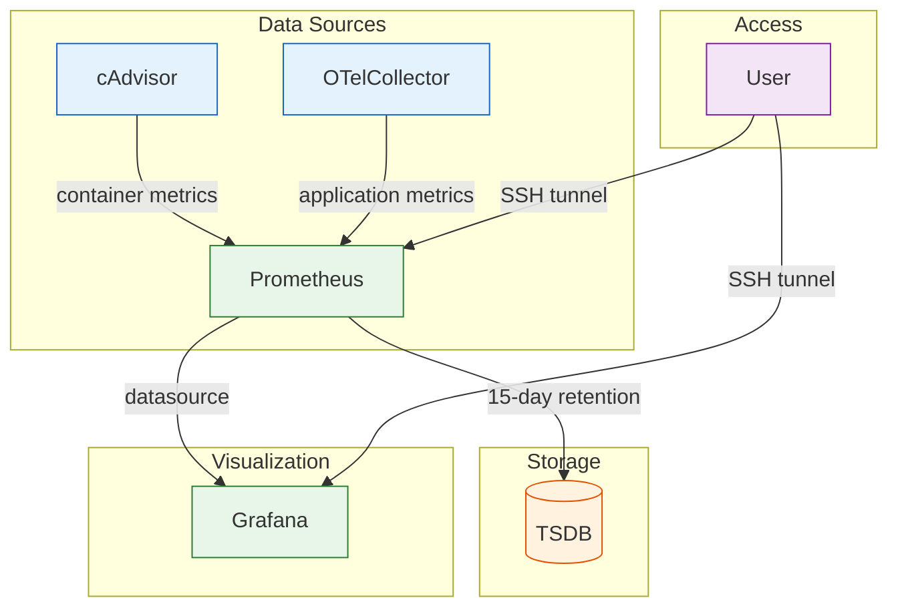

# Monitoring

> Monitoring stack, dashboards, and alerting for VEDO hub RAG Assistant.

## Overview

The monitoring stack collects container-level and application-level metrics:



## Stack Components

### cAdvisor

Exposes container-level resource metrics:

- **CPU usage** (per-container, by mode: user/system/total)
- **Memory usage** (RSS, cache, swap)
- **Network I/O** (bytes, packets, errors per interface)
- **Disk I/O** (read/write bytes and operations)
- **Container lifecycle** (restart counts, uptime)

**Port:** 8080 (internal only)
**Image:** `gcr.io/cadvisor/cadvisor:latest`
**Permissions:** `privileged: true` (required for host cgroup/container access)

### Prometheus

Time-series metrics database with 15-day retention.

**Port:** 9090 (internal only)
**Image:** `prom/prometheus:latest`
**Data:** `prometheus_data` volume

**Scrape targets:**

| Target | Endpoint | Interval | Data |
|--------|----------|----------|------|
| cAdvisor | `cadvisor:8080` | 15s | Container resource metrics |
| OTel Collector | `otel-collector:9090` | 15s | Application-level metrics |
| Backend (optional) | `backend:3000/metrics` | 15s | Application metrics (if `/metrics` exposed) |

### Grafana

Dashboard visualization with pre-configured Prometheus datasource.

**Port:** 3000 (internal only)
**Image:** `grafana/grafana:latest`
**Data:** `grafana_data` volume

**Default admin credentials:**
- Username: `admin`
- Password: set via `GF_SECURITY_ADMIN_PASSWORD` in `.env`

**Provisioning:**

| Resource | Path |
|----------|------|
| Prometheus datasource | `grafana/provisioning/datasources/prometheus.yml` |
| Dashboard provider | `grafana/provisioning/dashboards/dashboards.yml` |

## Access

All monitoring services are internal-only. Access via SSH tunnel:

```bash
# Grafana
ssh -L 3000:grafana:3000 user@host
# → http://localhost:3000

# Prometheus
ssh -L 9090:prometheus:9090 user@host
# → http://localhost:9090

# cAdvisor
ssh -L 8080:cadvisor:8080 user@host
# → http://localhost:8080/metrics
```

## Dashboards

### cAdvisor Container Monitoring (ID: 14282)

Available from [Grafana Dashboards](https://grafana.com/grafana/dashboards/14282). Import via:

1. Open Grafana → Dashboards → Import
2. Enter dashboard ID `14282`
3. Select Prometheus datasource
4. Import

Or use the Grafana API:

```bash
curl -X POST http://localhost:3000/api/dashboards/import \
  -H "Authorization: Bearer <api-token>" \
  -d '{"dashboard":{"id":null,"uid":"cadvisor-export","title":"cAdvisor Container Monitoring"},"overwrite":true}'
```

### Upcoming Dashboards

Additional dashboards planned:

- **Backend API Dashboard** — request latency, error rate, throughput (RPS)
- **RAG Pipeline Dashboard** — embedding latency, search latency, chunk counts
- **Database Dashboard** — connection pool size, query latency

## Alerts

No alerts are currently configured. The Prometheus config includes an `alerting` section as a placeholder for future Alertmanager integration.

### Planned Alert Rules

| Condition | Severity | Action |
|-----------|----------|--------|
| Container restart count > 5 in 1h | warning | Investigate crash loop |
| Memory usage > 80% of limit | warning | Review resource limits |
| Backend health endpoint down > 1m | critical | Restart backend service |
| Disk space < 10% | critical | Clean up old backups, expand volume |

## Log Aggregation

### Docker Logs

All services use the `json-file` logging driver:

| Setting | Value |
|---------|-------|
| Driver | `json-file` |
| Max size | 20 MB |
| Max files | 5 |

### OTel Collector

Structured logs, traces, and metrics are exported via OTLP to the collector:

- **gRPC endpoint:** `otel-collector:4317`
- **HTTP endpoint:** `otel-collector:4318`

The collector:
- Batches telemetry (1s timeout, 1024 items/batch)
- Enriches with resource attributes (environment, Docker metadata)
- Exports to stdout (debug output) and Prometheus (metrics only)

### Viewing Logs

```bash
# All services
docker compose logs -f

# Specific service
docker compose logs -f backend

# Search
docker compose logs backend 2>&1 | grep -i error

# OTel collector telemetry
docker compose logs --tail=100 otel-collector | grep -E '"severityText"|"body"'
```

## See Also

- [Runbook](runbook.md) — incident response procedures
- [Deployment](deployment.md) — environment configuration
- [Architecture](c4-architecture.md) — C4 model diagrams
- [Configuration](configuration.md) — environment variables reference
