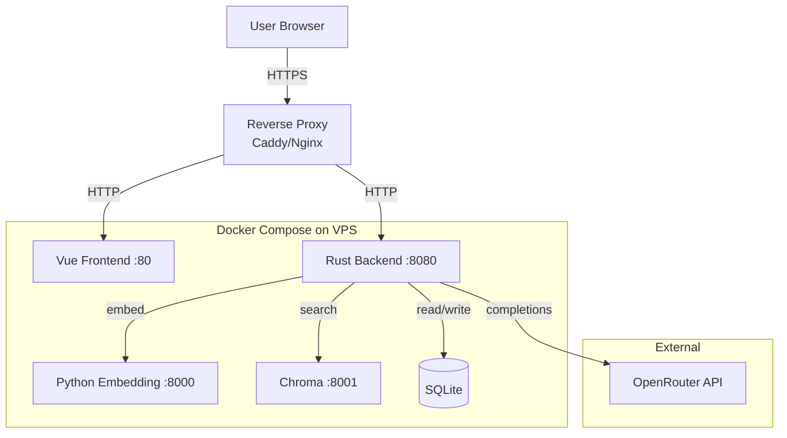

# Technical Specification: VEDO hub RAG Assistant (Personal Edition with CI)

> **Version:** 1.1-personal-ci  
> **Status:** Single-developer specification with GitHub Automation  
> **Target Deployment:** VPS with Docker Compose (no Kubernetes)  
> **Last Updated:** 2026-06-14  

---

## 1. System Overview and Goals

### 1.1 Purpose

VEDO hub RAG Assistant is a personal Q&A system that answers user questions about technical documentation. It ingests documents (PDF, Markdown, DOCX), indexes them in a vector database, and generates grounded answers using an LLM via OpenRouter. Every answer includes citations.

### 1.2 Primary Use Scenarios

| Scenario | User Action | System Behavior |
|---|---|---|
| **Ad-hoc Q&A** | Asks a question | Retrieves relevant chunks, streams LLM answer with citations |
| **Document ingestion** | Uploads a document (or ZIP) | Parses, chunks, embeds, indexes into Chroma |
| **Re-indexing** | Uploads new version | Old chunks marked inactive, new chunks added |
| **History review** | Opens past chat session | Loads messages from SQLite |

### 1.3 Quality Metrics (With CI)

| Metric | Target | How to Verify |
|---|---|---|
| **Build success** | Always passes | GitHub Actions CI must succeed on every push to `main` |
| **Tests pass** | 100% pass rate | `cargo test --lib` runs in CI |
| **Formatting** | `cargo fmt --check` | CI enforces consistent style |
| **Linting** | No `cargo clippy` warnings | CI runs Clippy with `-D warnings` |
| **Integration** | Basic flow works | CI spins up Chroma + embedding mock, tests upload → query |

*(No performance budgets, no coverage thresholds, no 50-question test set.)*

---

## 2. Functional Requirements

### 2.1 Document Upload

- **Supported formats:** PDF (`.pdf`), Markdown (`.md`), DOCX (`.docx`).
- **Max file size:** 50 MB per file.
- **Batch upload:** ZIP archive with up to 10 files (reject if more than 10 with HTTP 413).
- **Endpoint:** `POST /api/v1/documents/upload` (multipart/form-data).
- **Authentication:** Bearer token `ADMIN_API_KEY` required.
- **Validation:**
  - MIME type check (before buffering).
  - Magic bytes: PDF starts with `%PDF`, ZIP/DOCX starts with `PK\x03\x04`. Reject with 415 on mismatch.
  - ZIP bomb protection: track uncompressed size during extraction; abort if > 500 MB or > 10 files.
- **Folder structure inside ZIP:** preserved in metadata as `document_name: "folder/subfolder/file.md"`.

```json
// Response 201
{
  "document_id": "550e8400-e29b-41d4-a716-446655440000",
  "chunks_indexed": 47,
  "document_name": "spec_v2.pdf"
}
```

### 2.2 Indexing Pipeline

Steps executed in order:

1. **Parse:** Extract raw text:
   - PDF via `pdf-extract` crate (Rust-native).
   - DOCX via `docx-rs` crate.
   - Markdown via UTF-8 read.
2. **Chunk:** Use `text-splitter::TextSplitter` with `ChunkConfig::new(500, 50)` tokens. For CJK, fallback to `grapheme` segmentation.
3. **Embed:** Send batches (up to 32 chunks) to `POST /embed` on embedding service.
4. **Store in Chroma:**
   - Collection: `vedo_specs`
   - Metadata: `{chunk_id, document_id, document_name, page (optional), is_active, section_title (optional)}`
5. **Secrets scan (informational only):** Scan raw text for API keys, emails, bearer tokens using regex patterns from §3.4. Log WARN with filename and line number. Does not block indexing.

### 2.3 Question-Answer Interface

- **Query length limit:** 2000 characters. Return HTTP 400 with `{"error":"Query too long","max_length":2000}`.

- User sends `{query, session_id?}`.
- Backend:
  1. Embeds query via `POST /embed`.
  2. Queries Chroma (`top_k=5`, `where: {"is_active": true}`).
  3. Builds context from retrieved chunks (limited to 80% of model's context window).
  4. Prepends last 10 messages from dialog history (if session exists in SQLite).
  5. Sends to OpenRouter (streaming).
  6. Streams response to frontend via SSE.
  7. After stream completes, sends `sources` event, then `done`.
  8. Persists user message + assistant response to SQLite (or marks `incomplete=1` if interrupted).

- **Confidence indicator:** Compute average cosine similarity of top-5 chunks. If < 0.7, include `"confidence":"low"` in `sources` event. Frontend displays «Низкая уверенность».

- **Low-relevance refusal:** If average similarity < `RELEVANCE_THRESHOLD` (default 0.65), do NOT call LLM. Return refusal: *«Не могу найти точный ответ на основе загруженных документов. Попробуйте переформулировать вопрос.»*

```json
// Request
{
  "session_id": "session-uuid",  // optional, creates new if omitted
  "query": "Как настроить авторизацию?"
}

// SSE events
data: {"type":"chunk","text":"Для настройки..."}
data: {"type":"sources","sources":[...], "confidence":"low"}
data: {"type":"done"}
```

### 2.4 Collection Management

- **Re-index:** Upload with same `document_id` → old chunks `is_active=false`, new chunks added.
- **Soft delete:** `DELETE /api/v1/documents/{id}` → sets `is_active=false` on all chunks and document row.
- **Hard delete:** Not required for MVP (manual Chroma cleanup if needed).

### 2.5 Conversation History

- **Storage:** SQLite via `sqlx`.
- **Schema:**

```sql
CREATE TABLE sessions (
    id TEXT PRIMARY KEY,        -- UUID
    created_at TEXT NOT NULL
);

CREATE TABLE messages (
    id INTEGER PRIMARY KEY AUTOINCREMENT,
    session_id TEXT NOT NULL REFERENCES sessions(id),
    role TEXT NOT NULL CHECK(role IN ('user','assistant','system')),
    content TEXT NOT NULL,
    sources TEXT,                -- JSON array
    timestamp TEXT NOT NULL,
    incomplete INTEGER DEFAULT 0
);
```

- **Endpoints:** `GET /api/v1/sessions`, `GET /api/v1/sessions/{id}/messages`.

### 2.6 Export and Deletion (Simplified)

- **Data export:** Admin-only `GET /api/v1/admin/export` returns all messages in JSON Lines format (requires `Authorization: Bearer {ADMIN_API_KEY}`).
- **User deletion (right to be forgotten):** Upon request, delete all user data within 30 days (sessions, messages, Chroma vectors set to inactive).
- **Decommissioning export:** Before shutting down, run a one-off script to dump Chroma and SQLite to JSON Lines.
- **No one-click JSONL, no 3-click flow, no bulk deletion script** in MVP.

### 2.7 Developer Ergonomics (With CI)

- **CI/CD:** GitHub Actions runs on every push to `main` and pull requests.
- **Local development:** Run `cargo test` and `cargo fmt` manually before commits.
- **Code readability (encouraged, not enforced):**
  - Meaningful variable names.
  - Comments for complex logic.
  - `unwrap()` allowed in prototype code (document why it won't panic).
- **Onboarding:** `docs/development.md` with step-by-step instructions (verified manually).

---

## 3. Non-Functional Requirements

### 3.1 Performance (No strict budgets)

- **Expected performance on typical VPS (2 vCPU, 4 GB RAM):**
  - Embedding single chunk: ~150 ms.
  - Chroma search (top-5): ~100 ms.
  - Full pipeline (excl. LLM): < 800 ms.
  - LLM streaming starts within 2-3 seconds.
- **No automated measurement, no percentiles.**

### 3.2 Scalability (Not needed)

- **Single replica of each service.**
- **No auto-scaling, no load balancer, no Kubernetes.**
- **No Redis** — embedding cache removed.
- **Docker Compose** only (single profile).

### 3.3 Reliability (Simplified)

- **OpenRouter retry:** 2 attempts with 1-second delay. Retry on HTTP 429, 5xx.
- **Fallback model:** Not required (use only primary model).
- **Graceful degradation:**
  - Embedding service down → return HTTP 503.
  - Chroma down → return HTTP 503.
  - OpenRouter down → return HTTP 503.
- **No RTO/RPO requirements.**
- **Chroma backup:** Manual via `docker cp` or volume backup. Recommended cron script:

```bash
#!/bin/bash
# scripts/backup.sh
BACKUP_DIR="/backups/chroma"
TIMESTAMP=$(date +%Y%m%d_%H%M%S)
docker exec vedo-chroma-1 tar czf - /chroma_data > "$BACKUP_DIR/chroma_$TIMESTAMP.tar.gz"
# Keep last 7 backups
find "$BACKUP_DIR" -name "chroma_*.tar.gz" -mtime +7 -delete
```

### 3.4 Security (Reasonable for VPS deployment)

- **Personal data compliance:** Right to be forgotten (manual deletion within 30 days). No encryption at rest required (VPS disk encryption is responsibility of hosting provider).
- **Admin auth:** Static Bearer token (`ADMIN_API_KEY`) for upload endpoints. Token length ≥ 16 characters.
- **File validation:** MIME type + magic bytes (as in §2.1). PDF JavaScript scan and DOCX macro detection optional.
- **Rate limiting (per-IP via `tower-governor`):**
  - `/chat` — 30 requests/minute.
  - `/documents/upload` — 5 requests/minute.
- **CORS:** Allow only `CORS_ORIGIN` (set to your domain, e.g., `https://chat.yourdomain.com`).
- **Sensitive data scan:** Regex scan (emails, API keys) — log WARN, do not block.
- **Prompt injection protection:** Regular expressions only. Scan user query and retrieved chunks. If match → *«Запрос не может быть обработан по соображениям безопасности»*.
- **Collection size monitoring:** Log WARN at 400K vectors, no auto-rotation.
- **TLS termination:** Use reverse proxy (nginx, Caddy, or Traefik) in front of Docker Compose. Caddy recommended for automatic HTTPS:

```caddy
# Caddyfile
chat.yourdomain.com {
    reverse_proxy backend:8080
}
```

**Regex patterns for scanning:**

```rust
EMAIL: r"[\w.+-]+@[\w-]+(\.[\w-]+)+"
API_KEY: r"(?:sk-|pk-|api[_-]?key)[\s:=]+[\w-]{16,}"
BEARER: r"Bearer\s+[\w-]{20,}"
INJECTION: r"(?i)(?:ignore|forget|disregard|override).*(?:previous|system|instruction|prompt)"
```

### 3.5 Logging and Monitoring (Basic)

- **Log format:** Plain text via `tracing` with `env-filter`.
- **CI logs:** GitHub Actions captures all test output.
- **VPS logs:** `docker compose logs -f` for real-time monitoring. Optionally send to journald:

```yaml
# docker-compose.yml
logging:
  driver: "journald"
  options:
    tag: "vedo-{{.Name}}"
```

- **No Prometheus, no Grafana, no alerting.**

### 3.6 Development Environment Conditions (With CI)

**GitHub Actions workflow (`.github/workflows/ci.yml`):**

```yaml
name: CI

on:
  push:
    branches: [main]
  pull_request:
    branches: [main]

env:
  CARGO_TERM_COLOR: always

jobs:
  test:
    runs-on: ubuntu-latest
    steps:
      - uses: actions/checkout@v4
      
      - name: Cache cargo registry
        uses: actions/cache@v3
        with:
          path: |
            ~/.cargo/registry
            ~/.cargo/git
            target
          key: ${{ runner.os }}-cargo-${{ hashFiles('**/Cargo.lock') }}
          restore-keys: |
            ${{ runner.os }}-cargo-
      
      - name: Setup Rust
        uses: actions-rs/toolchain@v1
        with:
          toolchain: stable
          components: rustfmt, clippy
          override: true
      
      - name: Check formatting
        run: cargo fmt --check
      
      - name: Run clippy
        run: cargo clippy -- -D warnings
      
      - name: Run unit tests
        run: cargo test --lib
      
      - name: Run integration tests
        run: cargo test --test integration -- --ignored
```

**CI must include:**
1. `cargo fmt --check` — fail if formatting is inconsistent.
2. `cargo clippy -- -D warnings` — fail on any warning.
3. `cargo test --lib` — run unit tests.
4. Integration tests with Chroma + mock embedding (flagged `#[ignore]`).

**CI runtime budget:** ≤ 5 minutes with caching.

**Code coverage:** Not required.

**Secrets scanning:** Not required in CI (use `.gitignore` to avoid committing `.env`).

---

## 4. Architecture



**No Redis, no PostgreSQL, no load balancer, no Kubernetes.**

---

## 5. Detailed Component Design

### 5.1 Backend (Rust)

**Required crates (`Cargo.toml`):**

```toml
[package]
name = "vedo-help-backend"
version = "0.1.0"
edition = "2021"

[dependencies]
axum = "0.7"
tokio = { version = "1", features = ["full"] }
serde = { version = "1", features = ["derive"] }
serde_json = "1"
reqwest = { version = "0.12", features = ["json", "stream"] }
uuid = { version = "1", features = ["v4", "serde"] }
chrono = { version = "0.4", features = ["serde"] }
tracing = "0.1"
tracing-subscriber = { version = "0.3", features = ["env-filter"] }
tower-http = { version = "0.5", features = ["cors", "trace", "limit"] }
tower-governor = "0.3"
sqlx = { version = "0.7", features = ["runtime-tokio", "sqlite"] }
text-splitter = "0.4"
pdf-extract = "0.7"
docx-rs = "0.4"
axum-extra = { version = "0.9", features = ["multipart"] }
```

**Project structure:**

```
backend/
├── src/
│   ├── main.rs
│   ├── routes/
│   │   ├── mod.rs
│   │   ├── chat.rs
│   │   ├── documents.rs
│   │   └── sessions.rs
│   ├── services/
│   │   ├── mod.rs
│   │   ├── chunking.rs
│   │   ├── parsing.rs
│   │   ├── embedding_client.rs
│   │   ├── chroma_client.rs
│   │   ├── openrouter_client.rs
│   │   └── history.rs
│   └── models/
│       ├── mod.rs
│       ├── document.rs
│       ├── chunk.rs
│       ├── session.rs
│       ├── message.rs
│       └── api.rs
├── Cargo.toml
└── Dockerfile
```

**Chunking logic:**

```rust
use text_splitter::{TextSplitter, ChunkConfig};

const CHUNK_SIZE: usize = 500;    // tokens
const CHUNK_OVERLAP: usize = 50;  // tokens

pub fn chunk_document(text: &str, document_id: &str, doc_name: &str) -> ChunkResult {
    let splitter = TextSplitter::new(ChunkConfig::new(CHUNK_SIZE, CHUNK_OVERLAP));
    let chunks: Vec<&str> = splitter.chunks(text).collect();
    // Map each chunk → ChunkMetadata with sequential chunk_id
    ChunkResult { chunks, metadata }
}
```

**OpenRouter client:**

```rust
const MAX_RETRIES: u32 = 2;
const RETRY_DELAY_MS: u64 = 1000;
const PRIMARY_MODEL: &str = "mistralai/mixtral-8x7b-instruct";
const SYSTEM_PROMPT: &str = "\
Ты ассистент по документации. \
Отвечай только на основе предоставленного контекста. \
Если ответа нет в контексте, скажи об этом прямо. \
Всегда указывай источники в формате [Название документа].\
";
```

**Mock OpenRouter for CI:**

```rust
if env::var("OPENROUTER_MOCK").is_ok() {
    return stream_dummy_response("Test answer based on context");
}
```

### 5.2 Embedding Service (Python)

**Dockerfile:**

```dockerfile
FROM python:3.11-slim
RUN pip install sentence-transformers fastapi uvicorn
COPY app/ /app
WORKDIR /app
CMD ["uvicorn", "main:app", "--host", "0.0.0.0", "--port", "8000"]
```

**API:**

```python
from fastapi import FastAPI
from sentence_transformers import SentenceTransformer
from pydantic import BaseModel

app = FastAPI()
model = SentenceTransformer('sentence-transformers/paraphrase-multilingual-MiniLM-L12-v2')

class EmbedRequest(BaseModel):
    texts: list[str]

@app.post("/embed")
async def embed(req: EmbedRequest):
    embeddings = model.encode(req.texts, normalize_embeddings=True).tolist()
    return {"embeddings": embeddings}
```

- Batch size: 32 texts per request.
- Output dimension: 384.
- Model size: ~500 MB (downloaded on first start, cached in Docker volume).

**Mock embedding service for integration tests:**

```python
# tests/mock_embedding.py
import numpy as np

@app.post("/embed")
async def embed(req: EmbedRequest):
    vectors = []
    for text in req.texts:
        seed = hash(text) % 1000
        vec = np.random.RandomState(seed).randn(384)
        vec = (vec / np.linalg.norm(vec)).tolist()
        vectors.append(vec)
    return {"embeddings": vectors}
```

### 5.3 Chroma

**Docker Compose service:**

```yaml
chroma:
  image: chromadb/chroma:latest
  environment:
    - PERSIST_DIRECTORY=/chroma_data
    - IS_PERSISTENT=TRUE
  volumes:
    - chroma_data:/chroma_data
  ports:
    - "127.0.0.1:8001:8000"  # Bind to localhost only, behind reverse proxy
  restart: unless-stopped
```

**Collection configuration:**

- Name: `vedo_specs`
- Embedding function: none (pre-computed)
- Distance metric: cosine
- Index type: HNSW (default)

**Query from Rust:**

```rust
POST http://chroma:8001/api/v1/collections/vedo_specs/query
{
    "query_embeddings": [[0.012, -0.034, ...]],
    "n_results": 5,
    "where": { "is_active": true },
    "include": ["metadatas", "documents", "distances"]
}
```

### 5.4 Frontend (Vue 3 + TypeScript)

**Component tree:**

```
App.vue
├── ChatWindow.vue
│   ├── MessageBubble.vue
│   └── SourceCitation.vue
├── ChatInput.vue
└── DocumentUploader.vue
```

**State (Pinia store):**

```typescript
interface ChatStore {
  messages: Message[];
  currentSessionId: string | null;
  isStreaming: boolean;
  abortController: AbortController | null;
}
```

**SSE client:**

```typescript
async function sendChat(query: string, sessionId?: string) {
  const response = await fetch('/api/v1/chat', {
    method: 'POST',
    headers: { 'Content-Type': 'application/json' },
    body: JSON.stringify({ query, session_id: sessionId }),
  });
  const reader = response.body!.getReader();
  const decoder = new TextDecoder();
  while (true) {
    const { done, value } = await reader.read();
    if (done) break;
    const text = decoder.decode(value);
    for (const line of text.split('\n')) {
      if (line.startsWith('data: ')) {
        const event = JSON.parse(line.slice(6));
        switch (event.type) {
          case 'chunk': /* append to current message */ break;
          case 'sources': /* attach sources */ break;
          case 'done': /* finalize message */ break;
        }
      }
    }
  }
}
```

**Styling:** Tailwind CSS v4. Dark mode via `dark:` variant.

**Formatting & linting:** Biome (v1.9) replaces ESLint + Prettier.

**Production build:** Static files served by nginx inside container.

```dockerfile
# frontend/Dockerfile
FROM node:20 AS builder
WORKDIR /app
COPY package*.json ./
RUN npm ci
COPY . .
RUN npm run build

FROM nginx:alpine
COPY --from=builder /app/dist /usr/share/nginx/html
COPY nginx.conf /etc/nginx/conf.d/default.conf
EXPOSE 80
```

---

## 6. Data Model

### 6.1 SQLite Tables

```sql
CREATE TABLE documents (
    id TEXT PRIMARY KEY,
    name TEXT NOT NULL,
    created_at TEXT NOT NULL,
    is_active INTEGER DEFAULT 1
);

CREATE TABLE sessions (
    id TEXT PRIMARY KEY,
    created_at TEXT NOT NULL
);

CREATE TABLE messages (
    id INTEGER PRIMARY KEY AUTOINCREMENT,
    session_id TEXT NOT NULL REFERENCES sessions(id),
    role TEXT NOT NULL CHECK(role IN ('user','assistant','system')),
    content TEXT NOT NULL,
    sources TEXT,
    timestamp TEXT NOT NULL,
    incomplete INTEGER DEFAULT 0
);
```

### 6.2 Chroma Schema

| Field | Type | Example |
|---|---|---|
| `id` | string | `"chunk-550e8400-0003"` |
| `embedding` | float[384] | `[0.012, -0.034, ...]` |
| `document` | string | Chunk text content |
| `metadata.chunk_id` | string | `"chunk-550e8400-0003"` |
| `metadata.document_id` | string | `"550e8400-..."` |
| `metadata.document_name` | string | `"spec_v2.pdf"` |
| `metadata.page` | int (nullable) | `12` |
| `metadata.is_active` | bool | `true` |
| `metadata.section_title` | string (nullable) | `"Authentication"` |

---

## 7. Deployment (Docker Compose on VPS)

### 7.1 Directory Structure on VPS

```
/home/user/vedo-assistant/
├── docker-compose.yml
├── .env
├── data/
│   ├── backend/
│   │   └── app.db
│   ├── chroma/
│   └── backups/
├── scripts/
│   ├── backup.sh
│   └── restore.sh
└── caddy/
    └── Caddyfile
```

### 7.2 `docker-compose.yml`

```yaml
version: "3.8"

services:
  frontend:
    build: ./frontend
    container_name: vedo-frontend
    restart: unless-stopped
    networks:
      - internal
    depends_on:
      - backend

  backend:
    build: ./backend
    container_name: vedo-backend
    restart: unless-stopped
    environment:
      - DATABASE_URL=sqlite:///app/data/app.db
      - CHROMA_URL=http://chroma:8000
      - EMBEDDING_SERVICE_URL=http://embedding:8000
      - OPENROUTER_API_KEY=${OPENROUTER_API_KEY}
      - ADMIN_API_KEY=${ADMIN_API_KEY}
      - CORS_ORIGIN=${CORS_ORIGIN}
      - RUST_LOG=${RUST_LOG:-info}
      - RELEVANCE_THRESHOLD=${RELEVANCE_THRESHOLD:-0.65}
    volumes:
      - ./data/backend:/app/data
    networks:
      - internal
    depends_on:
      - chroma
      - embedding

  embedding:
    build: ./embedding
    container_name: vedo-embedding
    restart: unless-stopped
    environment:
      - MODEL_NAME=sentence-transformers/paraphrase-multilingual-MiniLM-L12-v2
    networks:
      - internal
    volumes:
      - embedding_cache:/root/.cache

  chroma:
    image: chromadb/chroma:latest
    container_name: vedo-chroma
    restart: unless-stopped
    environment:
      - PERSIST_DIRECTORY=/chroma_data
      - IS_PERSISTENT=TRUE
    volumes:
      - ./data/chroma:/chroma_data
    networks:
      - internal

networks:
  internal:
    driver: bridge

volumes:
  embedding_cache:
```

### 7.3 `.env` File

```bash
# Required
OPENROUTER_API_KEY=sk-or-v1-...
ADMIN_API_KEY=your-secure-admin-token-here

# VPS Configuration
CORS_ORIGIN=https://chat.yourdomain.com

# Optional
RUST_LOG=info
RELEVANCE_THRESHOLD=0.65
```

### 7.4 Reverse Proxy with Caddy

**Caddyfile:**

```caddy
chat.yourdomain.com {
    # Automatic HTTPS (Let's Encrypt)
    tls your-email@example.com
    
    # Frontend
    handle / {
        reverse_proxy vedo-frontend:80
    }
    
    # Backend API
    handle /api/* {
        reverse_proxy vedo-backend:8080
    }
    
    # Headers
    header {
        X-Content-Type-Options "nosniff"
        X-Frame-Options "DENY"
        Referrer-Policy "strict-origin-when-cross-origin"
    }
}
```

**Caddy Docker service (add to docker-compose.yml):**

```yaml
caddy:
  image: caddy:alpine
  container_name: vedo-caddy
  restart: unless-stopped
  ports:
    - "80:80"
    - "443:443"
  volumes:
    - ./caddy/Caddyfile:/etc/caddy/Caddyfile
    - caddy_data:/data
    - caddy_config:/config
  networks:
    - internal
  depends_on:
    - frontend
    - backend

volumes:
  caddy_data:
  caddy_config:
```

### 7.5 Deployment Commands

```bash
# First deployment
ssh user@your-vps.com

# Clone repository
git clone https://github.com/yourname/vedo-assistant.git
cd vedo-assistant

# Create .env file
cp .env.example .env
nano .env  # Add your API keys and domain

# Build and start
docker compose up -d --build

# Check logs
docker compose logs -f

# Update (after git pull)
docker compose down
docker compose up -d --build

# Backup (manual or via cron)
./scripts/backup.sh
```

### 7.6 Backup Script (`scripts/backup.sh`)

```bash
#!/bin/bash
BACKUP_DIR="/home/user/vedo-assistant/data/backups"
TIMESTAMP=$(date +%Y%m%d_%H%M%S)

# Backup SQLite
cp /home/user/vedo-assistant/data/backend/app.db "$BACKUP_DIR/app_$TIMESTAMP.db"

# Backup Chroma
tar czf "$BACKUP_DIR/chroma_$TIMESTAMP.tar.gz" -C /home/user/vedo-assistant/data/chroma .

# Keep last 14 days of backups
find "$BACKUP_DIR" -name "*.db" -mtime +14 -delete
find "$BACKUP_DIR" -name "*.tar.gz" -mtime +14 -delete

echo "Backup completed: $TIMESTAMP"
```

**Add to crontab:** `0 2 * * * /home/user/vedo-assistant/scripts/backup.sh`

### 7.7 Restore Script (`scripts/restore.sh`)

```bash
#!/bin/bash
BACKUP_FILE=$1
if [ -z "$BACKUP_FILE" ]; then
    echo "Usage: ./restore.sh <backup_file>"
    exit 1
fi

docker compose down
cp "$BACKUP_FILE" ./data/backend/app.db
tar xzf "$BACKUP_FILE" -C ./data/chroma
docker compose up -d
```

---

## 8. Testing Strategy

### 8.1 Rust Unit Tests

```bash
cargo test --lib
```

- Chunking logic (token count, overlap, CJK handling).
- Parsing with fixture files.
- Embedding client (mock HTTP).
- OpenRouter prompt assembly.

### 8.2 Integration Tests

```bash
cargo test --test integration -- --ignored
```

**Test scenario:**
1. Start Chroma via `testcontainers`.
2. Start mock embedding service.
3. Upload a test document.
4. Query for content.
5. Verify response contains expected text.

**Integration test example:**

```rust
#[tokio::test]
#[ignore]
async fn test_upload_and_query() {
    let docker = Cli::default();
    let chroma = docker.run(/* Chroma container */);
    let mock_embedding = start_mock_embedding_server().await;
    
    // Upload document
    let doc_id = upload_document("test.pdf").await;
    
    // Query
    let answer = query("What is authentication?").await;
    
    assert!(answer.contains("Bearer token"));
    assert!(answer.sources.len() > 0);
}
```

### 8.3 Python Tests

```bash
pytest embedding/tests/
```

- Test embedding model loads.
- Test batch embedding output dimension = 384.
- Test L2 normalization (norm ≈ 1.0).

### 8.4 Frontend Tests (Optional)

```bash
cd frontend && vitest run
```

- Component rendering.
- SSE event parsing.

### 8.5 CI Acceptance Criteria

1. `cargo fmt --check` passes.
2. `cargo clippy -- -D warnings` passes.
3. `cargo test --lib` passes.
4. `cargo test --test integration -- --ignored` passes.
5. Python tests pass (if implemented).

**CI must be green before merging to `main`.**

---

## 9. Security and Constraints

### 9.1 File Validation

| Check | Enforcement |
|---|---|
| MIME type | Reject if not allowed type |
| File size | Reject if > 50 MB |
| Magic bytes | PDF: `%PDF`, ZIP: `PK\x03\x04` |
| ZIP bomb | Reject if > 10 files or decompressed > 500 MB |
| PDF JavaScript | Optional (can skip in MVP) |
| DOCX macros | Optional (can skip in MVP) |

### 9.2 Rate Limiting

| Endpoint | Limit |
|---|---|
| `/api/v1/chat` | 30 requests/minute per IP |
| `/api/v1/documents/upload` | 5 requests/minute per IP |

### 9.3 CORS

Single origin via `CORS_ORIGIN`. Allowed methods: `GET`, `POST`, `DELETE`, `OPTIONS`.

### 9.4 Secrets

- `OPENROUTER_API_KEY` in `.env` file (never commit to Git).
- `ADMIN_API_KEY` in `.env` file.

### 9.5 Firewall Recommendations (VPS)

```bash
# UFW configuration
sudo ufw default deny incoming
sudo ufw default allow outgoing
sudo ufw allow 22/tcp   # SSH
sudo ufw allow 80/tcp   # HTTP (for Let's Encrypt)
sudo ufw allow 443/tcp  # HTTPS
sudo ufw enable
```

### 9.6 Data Retention and Deletion

- **Right to be forgotten:** Delete user data within 30 calendar days.
- **Deletion scope:**
  - All rows in `sessions` and `messages` tables.
  - Chroma vectors set to `is_active=false`.
- **Decommissioning export:** Manual dump of Chroma + SQLite before shutdown.

---

## 10. Assumptions

1. **SQLite is sufficient** for single-user personal project (< 10 concurrent sessions).

2. **VPS with 2 vCPU and 4 GB RAM** is sufficient for all services (Chroma, embedding model, backend, frontend, Caddy).

3. **Mixtral 8x7B Instruct is available on OpenRouter** with sufficient quota.

4. **Chroma default HNSW index** works well for up to 100K vectors.

5. **`text-splitter` crate** handles CJK tokenization correctly via `tiktoken-rs`.

6. **Model dimension is 384** (hardcoded; changing model requires code update).

7. **All documents contain extractable text.** Scanned PDFs (image-only) return error.

8. **OpenRouter API base URL** is `https://openrouter.ai/api/v1`.

9. **No streaming aggregation buffer** — each SSE event flushed immediately.

10. **No Redis cache** — embedding calls happen on every query (acceptable for single user).

11. **GitHub Actions runner** has enough resources to run Chroma in a container (~7 GB RAM, 2 cores).

12. **OpenRouter is NOT called in CI** — mock client replaces real API calls.

13. **Caddy (or nginx) handles TLS termination** — backend runs plain HTTP internally.

14. **Domain name is configured** with A record pointing to VPS IP address.

---

## 11. Roadmap

> Карта развития продукта — от текущего MVP к промышленной эксплуатации.
> Обновлено: 2026-06-15.

| Этап | Статус | Состав | Признак готовности |
|------|--------|--------|--------------------|
| **MVP** — базовый RAG pipeline | ✅ **Завершён** | Загрузка PDF/MD/DOCX, чанкинг, embedding (bge-small-en-v1.5), Chroma indexing, LLM стриминг (OpenRouter), SSE, авторизация, коллекции, история сессий, экспорт/удаление, CI (GitHub Actions), Docker Compose (5 сервисов), Caddy reverse proxy, dev/override/production конфиги, скрипты деплоя/бэкапа/восстановления, smoke-тесты, production hardening (non-root, tmpfs, resource limits) | Все 6 фаз из `.ai-factory/plans/feature-rag-assistant-full.md` выполнены (20/20 задач) |
| **v0.2 — Production Polish** | 🔜 **В плане** | **1. E2E-тесты (Playwright):** полный сценарий upload → query → sources — запуск в CI (headless Chrome). **2. Интеграционные тесты:** развернуть Chroma в CI, убрать `--ignored`. **3. ZIP-загрузка:** batch upload до 10 файлов (HTTP 413 при превышении), рекурсивная распаковка. **4. Re-indexing:** обновление документа с деактивацией старых чанков. **5. Индикатор уверенности (confidence):** отображение relevance score в UI (источники). **6. Graceful degradation:** fallback-модель при отказе primary, кэширование ответов на частые вопросы | CI: все тесты проходят; ручное тестирование upload ZIP и re-index; score в UI |
| **v0.3 — Observability & Reliability** | 🔜 **В плане** | **1. Structured logging:** агрегация логов (json-file driver c ротацией). **2. Метрики:** healthcheck с глубокой проверкой зависимостей (Chroma, embedding). **3. Rate limiting:** настройка per-route, защита /api/query от abuse. **4. Автоматический бэкап:** cron/builtin scheduler для SQLite + Chroma по расписанию. **5. Уведомления о сбоях:** webhook/integration с Telegram или email при падении сервиса. **6. Graceful shutdown:** корректное завершение всех контейнеров (уже частично реализовано) | docker compose ps — все healthy; бэкапы создаются автономно; уведомление при Failure |
| **v0.4 — Advanced RAG** | 🔜 **В плане** | **1. Hybrid search:** векторный поиск + keyword (BM25/Full-text SQLite) с fusion. **2. Reranker:** кросс-энкодер для переранжирования top-k результатов. **3. Query expansion:** генерация альтернативных формулировок вопроса через LLM. **4. Multi-turn context:** улучшенное использование истории диалога (smarter sliding window). **5. Document Q&A:** ответ строго по одному документу (collection-level scoping уже работает, но нужен точный retrieval). **6. Поддержка большего числа форматов:** CSV, JSON, HTML-to-text | Метрики качества ответов (precision/recall@k); A/B тестирование с текущим pipeline |
| **v0.5 — Multi-user & Security** | 🔜 **В плане** | **1. Аутентификация:** login/register (сессии или JWT), регистрация первого пользователя — создание ADMIN_API_KEY. **2. Multi-tenancy:** изоляция коллекций и документов по пользователю. **3. RBAC:** admin (полный доступ) / user (только свои коллекции). **4. Audit log:** логирование всех API-вызовов с user_id и action. **5. CORS hardening:** строгие origin вместо permissive. **6. Penetration testing:** базовый OWASP-скрининг | Аутентификация в CI; audit лог в SQLite; нет high-секьюрити уязвимостей (SAST scan) |
| **v1.0 — Production Ready** | 🔜 **В плане** | **1. CI/CD:** автоматический деплой на VPS при push в main (GitHub Actions → SSH → docker compose). **2. Performance:** нагрузочное тестирование (k6/locust), target: P99 < 10s для полного цикла query. **3. SLA:** документированный SLA, автоматическое восстановление (restart + healthcheck — уже есть, но нужно formalize). **4. UI polish:** loading states, error toasts, responsive design, тёмная тема. **5. Документация:** пользовательская (GUI guide), операторская (runbook), архитектурная (C4 diagrams). **6. Мониторинг:** базовые дашборды (метрики системы через cAdvisor + Prometheus, или упрощённый вариант) | CI/CD pipeline deploy; performance tests pass; runbook проверен на fresh VPS |

### Ключевые решения по приоритетам

| Решение | Обоснование |
|---------|------------|
| **E2E-тесты раньше multi-user** | Без E2E невозможно безопасно рефакторить под multi-tenancy |
| **ZIP и re-indexing раньше мониторинга** | Критические сценарии использования (docs ingestion) должны быть стабильны |
| **Observability раньше Advanced RAG** | Нельзя улучшать то, что не измеряется |
| **Multi-user — предпоследний этап** | Требует перестройки data model и ретестирования всего pipeline |
| **Production CI/CD — последний этап перед v1.0** | Должна быть уверенность в стабильности всех компонентов

---

## 12. Quick Start (Deploy to VPS)

```bash
# On your VPS
git clone https://github.com/yourname/vedo-assistant.git
cd vedo-assistant

# Configure
cp .env.example .env
nano .env  # Add OPENROUTER_API_KEY, ADMIN_API_KEY, CORS_ORIGIN

# Configure Caddy
nano caddy/Caddyfile  # Set your domain and email

# Start everything
docker compose up -d --build

# Check status
docker compose ps
docker compose logs -f

# Your assistant is now live at https://chat.yourdomain.com
```

---

## 13. Summary of Key Decisions

| Feature | Decision | Rationale |
|---|---|---|
| **CI** | GitHub Actions with fmt, clippy, unit tests, integration tests | Catch mistakes before merging |
| **Deployment** | Docker Compose on VPS | Simpler than Kubernetes, sufficient for personal use |
| **Reverse Proxy** | Caddy (automatic HTTPS) | Zero-config TLS, built-in Let's Encrypt |
| **Redis** | Removed | Not needed for single user |
| **Embedding cache** | Removed | Direct calls are fast enough |
| **Performance budgets** | No strict targets | Subjective "feels fast" is sufficient |
| **Code coverage** | Not required | Not meaningful for solo developer |
| **Auto-scaling** | Not needed | Single replica |
| **Fallback model** | Removed | Retry primary; fail if down |
| **Accessibility (WCAG)** | Removed | Only developer uses it |
| **Geo-redundancy** | Removed | Single region |
| **Canary releases** | Removed | Manual updates |
| **RTO/RPO** | Removed | Restart if something breaks |
| **Grafana/Prometheus** | Removed | `docker compose logs` is enough |
| **Kubernetes** | Explicitly not used | Overkill for personal VPS |

---

**End of Specification**
